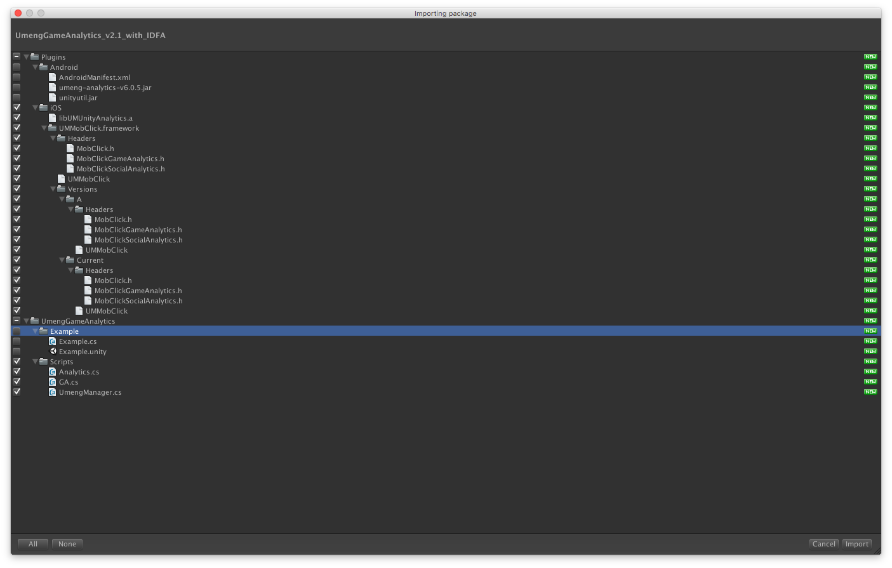
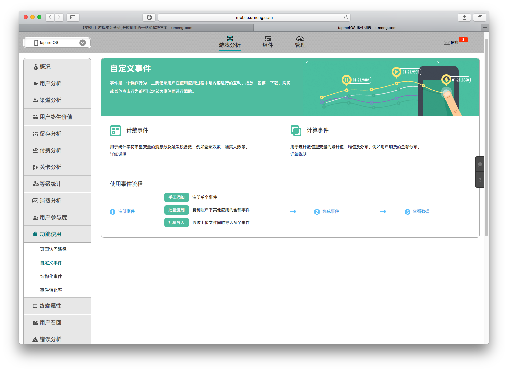

###友盟统计SDK
######虽然很简单，但还是要说一波
>去[官网](http://dev.umeng.com/game_analytics/game-unity/integration#2_2)下载unity版友盟game统计，我下的是  
>**UmengGameAnalytics_v2.1_with_IDFA.unitypackage**
>

然后开始集成，先导包。  

因为需要接入的是iOS版，所以我把android的取消勾选了。  
>1.首先初始化  
>
>		Umeng.GA.StartWithAppKeyAndChannelId ("your app key", "App Store");
第二个参数是对应的渠道名，这里我们发布到AppStore，所以渠道名就填AppStore。  

>2.记录要统计的事件
>
>		Umeng.GA.Event (event_name);
>**⚠️注意:**   
>
>*  要在Xcode添加libz.tbd，libsqlite3.tbd依赖
>*  统计的事件的名字要在友盟后台填写字段
>*  Unity5.0以下的版本不会将Plugins->iOS下文件夹的内容打包进xcode所以需要手动将UMMobClick.framework手动拖到Xcode里

  
我只需要这两个功能，但是友盟统计的功能远不止这些，戳[这里](http://dev.umeng.com/game_analytics/game-unity/integration#1)去了解。