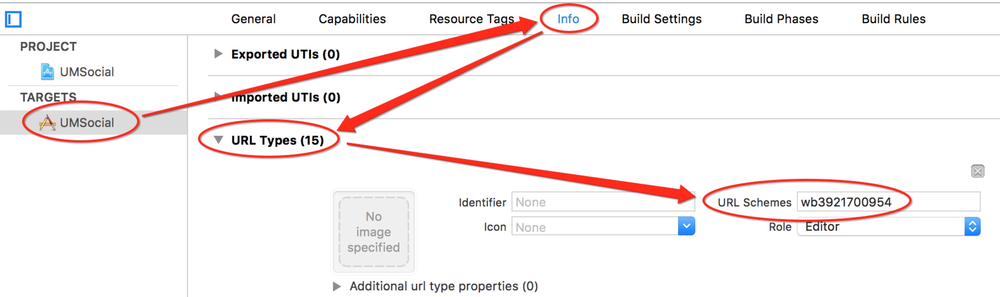
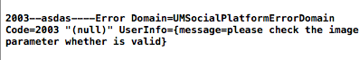
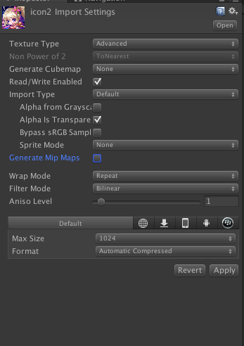

###友盟分享
许多游戏都有分享功能，这里我们来学习一下友盟分享的接入。  
我接入的是友盟`Unity3D v6.2.0`版本。去[这里](http://dev.umeng.com/social/unity3d/sdk-download)下载。下载好后就开始接入吧。其实[官网的接入流程](http://dev.umeng.com/social/unity3d/integration)还是挺详细的, 不过我还是要啰嗦一遍😁   
>####1.首先导入unity包。
>
  

这里我只需要iOS版里的QQ、Sina和微信的第三方SDK。  
>####2.开始调用  
>定义分享平台  
>`Platform[] platforms = { Platform.QQ,Platform.QZONE,Platform.SINA,Platform.WEIXIN,Platform.WEIXIN_CIRCLE};`  
>调用分享面板  
>`Social.OpenShareWithImagePath (platforms,"Hello World", Application.persistentDataPath + "/Sceenshot.png","umeng","http://www.umeng.com/", sharecallback);`  
>####注意⚠️：  
>1)这里Sceenshot.png需要预先存储在Application.persistentDataPath路径下。  
>
>*  例如采用unity自带截屏函数`Application.CaptureScreenshot("Sceenshot.png");`  
>*  也可以使用C#里System.IO命名空间下的文件操作函数进行写入
>
>			public Texture2D ShareImage;
			if (!File.Exists (Application.persistentDataPath + "/Sceenshot.png")) {
			File.WriteAllBytes (Application.persistentDataPath + "/Sceenshot.png", ShareImage.EncodeToPNG ());
			Debug.Log ("File.WriteAllBytes path =" + Application.persistentDataPath + "/Sceenshot.png");
			}
>
>2) 这里的sharecallback是分享的回调，里面包含有分享的平台与错误代码等信息。例如：  
>
>     public void sharecallback (Platform platform, int stCode, string errorMsg)
	{
		Debug.Log (stCode.ToString () + "-----" + errorMsg);
		if (stCode == Social.SUCCESS) {
		......
		}
	}

调用结束后就可以打包到Xcode工程里了,什么，你说Key和secret还没设置，这个是放到Xcode里初始化的，当然原来是在unity里就可以初始化了。这次友盟SDK更新的有点坑。😂  
>####3.unity5.0以下版本
>小于unity5.0的版本记得把Plugins->iOS->UMSocial文件夹拖到Xcode工程里。
>####4.打包好Xcode工程后找到UnityAppController.mm文件做出如下修改:  
>头文件添加：  
>`#import <UMSocialCore/UMSocialCore.h>`  
>在`- (BOOL)application:(UIApplication*)application didFinishLaunchingWithOptions:(NSDictionary*)launchOptions` 方法中添加sdk的初始化代码：（其中`[UMSocialGlobal shareInstance].type = @"u3d"`;必须要添加，否则无法定位错误）  
>
>	  
	[[UMSocialManager defaultManager] openLog:YES];
	NSLog(@"UMeng social version: %@", [UMSocialGlobal umSocialSDKVersion]);
	[UMSocialGlobal shareInstance].type = @"u3d";
	//设置友盟appkey
	[[UMSocialManager defaultManager] 	setUmSocialAppkey:@"57b432afe0f55a9832001a0a"];
	//设置微信的appKey和appSecret
	[[UMSocialManager defaultManager] setPlaform:UMSocialPlatformType_WechatSession appKey:@"wxdc1e388c3822c80b" appSecret:@"3baf1193c85774b3fd9d18447d76cab0" redirectURL:@"http://mobile.umeng.com/social"];
	//设置分享到QQ互联的appID
	[[UMSocialManager defaultManager] setPlaform:UMSocialPlatformType_QQ appKey:@"100424468"/*设置QQ平台的appID*/  appSecret:nil redirectURL:@"http://mobile.umeng.com/social"];
	//设置新浪的appKey和appSecret
	[[UMSocialManager defaultManager] setPlaform:UMSocialPlatformType_Sina appKey:@"3921700954"  appSecret:@"04b48b094faeb16683c32669824ebdad" redirectURL:@"http://sns.whalecloud.com/sina2/callback"];
>  

这里的key要记得替换为自己申请的哦。  
千万万万注意初始化友盟的Key😭不然你的分享面板会一片空白！！！
>####5.**回调:**  
>记得还要在`- (BOOL)application:(UIApplication*)application openURL:(NSURL*)url sourceApplication:(NSString*)sourceApplication annotation:(id)annotation`方法中添加如下代码：  
>`BOOL result = [[UMSocialManager defaultManager] handleOpenURL:url];`  
>不然回调永远也不会成功。(在这里踩过坑😂)  
>####6.还要添加第三方平台依赖库  
>在**General->Linked Frameworks and Libraries**下添加  
>系统库：  
>
>     libsqlite3.tbd
    CoreGraphics.framework  
微信：
>
>     SystemConfiguration.framework
	CoreTelephony.framework
	libsqlite3.tbd
	libc++.tbd
	libz.tbd  
QQ：
>
>     SystemConfiguration.framework
	libc++.tbd  
新浪微博：
>
>     SystemConfiguration.framework
	CoreTelephony.framework
	ImageIO.framework
	libsqlite3.tbd
	libz.tbd
>####7.Build Settings->Linking->Other Linker Flags 设置-ObjC  
>  
>####8.配置SSO白名单  
>如果你的应用使用了如SSO授权登录或跳转到第三方分享功能，在iOS9/10下就需要增加一个可跳转的白名单，即`LSApplicationQueriesSchemes`([详解见Xcode_config第二条](./Xcode_config.html).  
)，否则将在SDK判断是否跳转时用到的canOpenURL时返回NO，进而只进行webview授权或授权/分享失败。 在项目中的info.plist中加入应用白名单，右键info.plist选择source code打开(plist具体设置在`Build Setting -> Packaging -> Info.plist File`可获取plist路径) 请根据选择的平台对以下配置进行裁剪:  
>
>     <key>LSApplicationQueriesSchemes</key>
	<array>
    <!-- 微信 URL Scheme 白名单-->
    <string>wechat</string>
    <string>weixin</string>
    <!-- 新浪微博 URL Scheme 白名单-->
    <string>sinaweibohd</string>
    <string>sinaweibo</string>
    <string>sinaweibosso</string>
    <string>weibosdk</string>
    <string>weibosdk2.5</string>
    <!-- QQ、Qzone URL Scheme 白名单-->
    <string>mqqapi</string>
    <string>mqq</string>
    <string>mqqOpensdkSSoLogin</string>
    <string>mqqconnect</string>
    <string>mqqopensdkdataline</string>
    <string>mqqopensdkgrouptribeshare</string>
    <string>mqqopensdkfriend</string>
    <string>mqqopensdkapi</string>
    <string>mqqopensdkapiV2</string>
    <string>mqqopensdkapiV3</string>
    <string>mqqopensdkapiV4</string>
    <string>mqzoneopensdk</string>
    <string>wtloginmqq</string>
    <string>wtloginmqq2</string>
    <string>mqqwpa</string>
    <string>mqzone</string>
    <string>mqzonev2</string>
    <string>mqzoneshare</string>
    <string>wtloginqzone</string>
    <string>mqzonewx</string>
    <string>mqzoneopensdkapiV2</string>
    <string>mqzoneopensdkapi19</string>
    <string>mqzoneopensdkapi</string>
    <string>mqqbrowser</string>
    </array>  

不添加的话分享面板是不会显示出来对应平台的哦。  
>####9.URL Scheme  
>URL Scheme是用来跳转APP的  
>info->URL Types->+
  
这里设置QQ的key时注意是**“QQ”+腾讯QQ互联应用appID转换成十六进制（不足8位前面补0）**  
也可已在info.plist里设置

	<key>CFBundleURLTypes</key>
	  <array>
	      <dict>
	          <key>CFBundleTypeRole</key>
	          <string>Editor</string>
	          <key>CFBundleURLName</key>
	          <string>QQ分享</string>
	          <key>CFBundleURLSchemes</key>
	          <array>
	              <string>QQ41ecb0ca</string>
	          </array>
	      </dict>
	      <dict>
	          <key>CFBundleTypeRole</key>
	          <string>Editor</string>
	          <key>CFBundleURLName</key>
	          <string>QQ空间</string>
	          <key>CFBundleURLSchemes</key>
	          <array>
	              <string>tencent1106030794</string>
	          </array>
	      </dict>
	      <dict>
	          <key>CFBundleTypeRole</key>
	          <string>Editor</string>
	          <key>CFBundleURLName</key>
	          <string>微信</string>
	          <key>CFBundleURLSchemes</key>
	          <array>
	              <string>wxd48f07b4b4bad42a</string>
	          </array>
	      </dict>
	      <dict>
	          <key>CFBundleTypeRole</key>
	          <string>Editor</string>
	          <key>CFBundleURLName</key>
	          <string>新浪微博</string>
	          <key>CFBundleURLSchemes</key>
	          <array>
	              <string>wb667496208</string>
	          </array>
	      </dict>
	  </array>

>####10.Build Setting -> Packaging -> Info.plist添加HTTP传输允许 
> 
>	  <key>NSAppTransportSecurity</key>
	<dict>
    <key>NSAllowsArbitraryLoads</key>
    <true/>
	</dict>  
>####11.额。。差不多了吧  
如果分享的图片出现如下问题：  
  
可以将检查下  
  
是不是图片的属性没有设置正确。😝