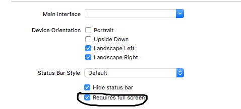
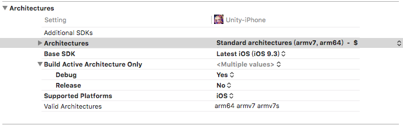
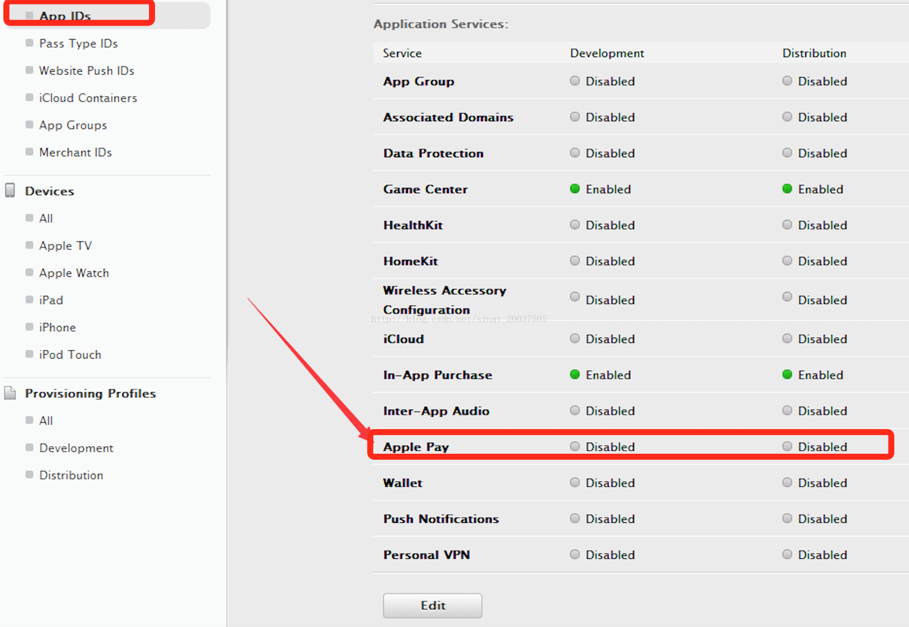

##ipa提交Application loader常见错误

###错误1
* ERROR ITMS-90474: "Invalid Bundle. iPad Multitasking support requires these orientations: 'UIInterfaceOrientationPortrait,UIInterfaceOrientationPortraitUpsideDown,UIInterfaceOrientationLandscapeLeft,UIInterfaceOrientationLandscapeRight'. Found 'UIInterfaceOrientationPortrait,UIInterfaceOrientationLandscapeLeft,UIInterfaceOrientationLandscapeRight' in bundle "bundle_Name"

#####解决办法

#####或
Edit your plist file from xcode and add those lines
>		<key>UIRequiresFullScreen</key>
>		<true/>

---
    
###错误2
* ERROR ITMS-90086: "Missing 64-bit support. iOS apps submitted to the App Store must include 64-bit support and be built with the iOS 8 SDK or later. We recommend using the default "Standard Architectures" build setting for "Architectures" in Xcode, to build a single binary with both 32-bit and 64-bit support."
#####解决办法  
  
将Architectures改为同时兼容arm7和arm64打包。  

### 错误3
* 使用权限 [com.apple.developer.in-app-payments] 的 App 必须为[Simplified Chinese, English, Traditional Chinese]提供隐私政策。如果您的 App 不使用这些权限，请将它们从您的 App 中移除并上传新的二进制文件。  

开通了ApplePay支付，却没有集成该功能，被苹果商店审核不通过！ 

登录苹果开发者平台，https://developer.apple.com/ ，关闭该应用的App ID下开通的 Apple Pay 功能；  
