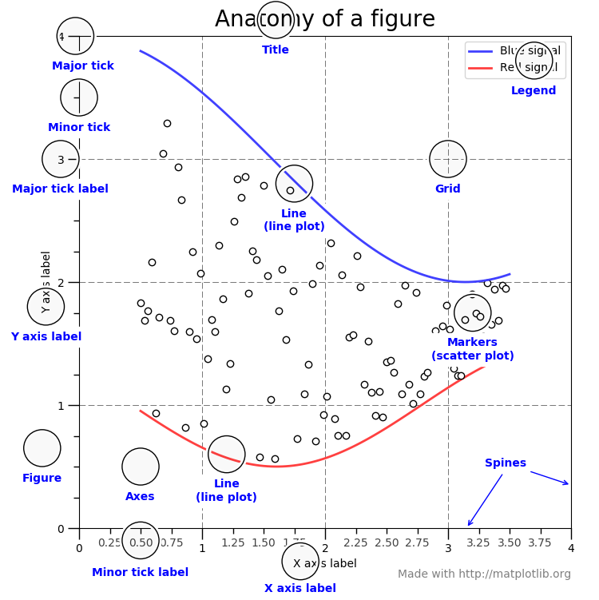

### matplotlib

[官网](https://matplotlib.org/2.0.2/faq/usage_faq.html#general-concepts)

matplotlib是python的一个绘图插件。

绘图既可以普通的绘制一个二维数组，或者是将屏幕绘制成红色，目的都是为了协助你更好的可视化数据。


顶层：状态机环境，添加绘制元素，(lines, images, text, etc.)到axes。

二层：面向对象。用来创建figures和axes。



#### Figure

整个的图形。包含所有Axes坐标系的引用，和一些特殊的界面元素artists(titles,figure legends,etc),和画布。

一个简单创建Figure的方式。

```python
fig = plt.figure()  # 创建一个没有坐标系的空Figure
fig, ax_lst = plt.subplots(2, 2)  # 创建有2x2个坐标系的fig，坐标系的引用为ax_lst
```

#### Axes

一个带有数据的图像区域，一个Figure可以包含多个坐标系，但是一个坐标系只能放在一个Figure中。一个坐标系包含两个(3d时是三个)**坐标轴Axis对象**。

对于坐标系的显示范围限制，通过Axes中的方法`set_xlim()`和`set_ylim()`进行限制，每一个坐标系都有一个标题，通过`set_title()`设置，还有坐标系标签x-label，y-label分别通过`set_xlabel()` 和`set_ylabel()`设置。

Axes类是和它需要的成员函数是使用面向对象思想。

#### Axis

坐标轴，负责**图像的边界**和**刻度的长度**，**刻度的标签**。刻度的位置由`Locator`类设置，刻度的标签名通过`Formatter`类设置。组合这两个类可以控制刻度的位置和标签的名字。

#### Artist

Figure上所有可见的元素都是artist(甚至Figure，Axes，和Axis对象)。

Text，Line2D，collection和Patch对象等。大多数Artists是绑定在Axes坐标系中的，例如一个Artists不能被多个坐标系共有，或者从一个坐标系移动到另一个。

### 绘图函数的输入类型

所有的绘图都需要`np.array` 或者 `np.ma.masked_array`作为数据输入。

#### Matplotlib, pyplot and pylab，他们有什么联系

Matplotlib是整个工具包。`matplotlib.pyplot`是Matplotlib的一个模块。pylab是和Matplotlib一起安装的模块。

Pyplot在面向对象的绘图库函数里提供了一个状态机的接口。为了获得需要的plot这个状态机实现了自动创建figures 和坐标系。

如：

```python
import matplotlib.pyplot as plt
import numpy as np
x = np.linspace(0, 2, 100)
plt.plot(x, x, label='linear')
plt.plot(x, x**2, label='quadratic')
plt.plot(x, x**3, label='cubic')

plt.xlabel('x label')
plt.ylabel('y label')
plt.title("Simple Plot")
plt.legend()
plt.show()
```

第一次调用plt.plot将自动创建需要的figure和坐标系，

接下来调用plt.plot会自动在上面的坐标系上叠加绘制新的函数，然后设置title, legend, and axis labels，都是相当于使用第一次调用plt.plot创建的单例figure。

pylab是一个便捷模块，可在单个名称空间批量导入`matplotlib.pyplot`和`numpy`的模组。

#### 代码风格

当看文档和例子时，你会发现有不同的风格和用法，这些风格都是可以的，有自己优缺点。所有的例子都可以转换成另一种风格而具有相同的结果，唯一需要注意的是避免让自己的代码风格混淆

导入时：

```
import matplotlib.pyplot as plt
import numpy as np
```

使用时：

```
x = np.arange(0, 10, 0.2)
y = np.sin(x)
fig = plt.figure()
ax = fig.add_subplot(111)
ax.plot(x, y)
plt.show()
```

为什么要打这么多行而不是直接使用`plt.plot(x, x, label='linear')`

冗长的风格更能明确清晰地表达事情的来源和发生了什么。随着程序变得复杂。这种清晰性变得越来越有价值，使面向对象的程序更易于编写和维护。

例如：

```python
def my_plotter(ax, data1, data2, param_dict):
    """
    A helper function to make a graph

    Parameters
    ----------
    ax : Axes
        The axes to draw to

    data1 : array
       The x data

    data2 : array
       The y data

    param_dict : dict
       Dictionary of kwargs to pass to ax.plot

    Returns
    -------
    out : list
        list of artists added
    """
    out = ax.plot(data1, data2, **param_dict)
    return out
```

使用端：

```python
fig, ax = plt.subplots(1, 1)
my_plotter(ax, data1, data2, {'marker':'x'})
```

或者

```python
fig, (ax1, ax2) = plt.subplots(1, 2)
my_plotter(ax1, data1, data2, {'marker':'x'})
my_plotter(ax2, data3, data4, {'marker':'o'})
```

