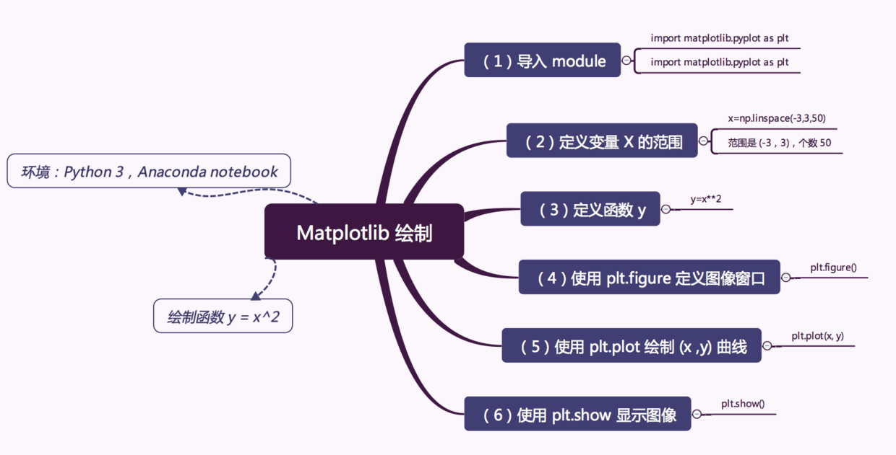

#### 使用python的pyplot绘制函数



```
import matplotlib.pyplot as plt
import numpy as np

# 定义 x 变量的范围 (-3，3) 数量 50 
x=np.linspace(-3,3,50)
y=x**2

# Figure 并指定大小
plt.figure(num=3,figsize=(8,5))
# 绘制 y=x^2 的图像，设置 color 为 red，线宽度是 1，线的样式是 --
plt.plot(x,y,color='red',linewidth=1.0,linestyle='--')

# 设置 x，y 轴的范围以及 label 标注
plt.xlim(-1,2)
plt.ylim(-2,3)
plt.xlabel('x')
plt.ylabel('y')

# 设置坐标轴刻度线 
# Tick X 范围 (-1，2) Tick Label(-1，-0.25，0.5，1.25，2) 刻度数量 5 个
new_ticks=np.linspace(-1,2,5)
plt.xticks(new_ticks)

# Tick Y 范围(-2.2,-1,1,1.5,2.4) ，Tick Label (-2.2, -1, 1, 1.5, 2.4) 别名(下面的英文)
plt.yticks([-2.2,-1,1,1.5,2.4],
          [r'$really\ bad$',r'$bad$',r'$normal$',r'$good$',r'$really\ good$'])

# 设置坐标轴 gca() 获取坐标轴信息
ax=plt.gca()
# 使用.spines设置边框：x轴；将右边颜色设置为 none。
# 使用.set_position设置边框位置：y=0的位置；（位置所有属性：outward，axes，data）
ax.spines['right'].set_color('none')
ax.spines['top'].set_color('none')

# 移动坐标轴
# 将 bottom 即是 x 坐标轴设置到 y=0 的位置。
ax.xaxis.set_ticks_position('bottom')
ax.spines['bottom'].set_position(('data',0))

# 将 left 即是 y 坐标轴设置到 x=0 的位置。
ax.yaxis.set_ticks_position('left')
ax.spines['left'].set_position(('data',0))

plt.grid()  # 生成网格
# 显示图像
plt.show()

# 设置标签
ax.set_title('y = x^2',fontsize=14,color='r')

作者：随时学丫
链接：https://juejin.im/post/5b635f6551882519d3468a53
```


1. 一元一次

   ```
   import matplotlib.pyplot as plt
   import numpy as np
    
   x = np.arange(0, 10, 0.1)
    
   y = x * 2
    
   plt.title("一元一次函数")
   plt.plot(x, y)
   ```

   

2. 一元二次

   ```
   y = x**2 + 2*x + 1
   ```

3. 指数

   ```
   y = 2**x
   ```

4. 自然对数

   ```
   e = math.e
   y = e**x
   ```

5. 正弦

   ```
   # linspace 第一个参数序列起始值, 第二个参数序列结束值,第三个参数为样本数默认50
   x = np.linspace(-np.pi, np.pi, 100)
   y = np.sin(x)
   ```

6. 蛇皮函数

   ```
   //sign(t) t>=0 输出1 t<0输出-1    fmod得到x/y的余数
   y = x - 2.0 * np.floor(x/2.0);
   z =1-(np.sign(np.fmod(126.0, np.fmod(x, 6.0) + 6.0)));
   ```


7. 两个输入一个输出的二维图

```
   ```
   import matplotlib.pyplot as plt
   import numpy as np
   import math
   fig, ax = plt.subplots()
   xNum = 10;
   yNum = 10;
   data_array = np.zeros((xNum, yNum, 3), dtype=np.int)
   for x in range(0, xNum):
       for y in range(0, yNum):
           coordX = x / xNum
           coordY = y / yNum
           # modf整数小数分离   0 - 小数部分  1 - 整数部分
           result = (464727.0 / pow(2.0, math.floor(math.modf(coordX)[0] * 4.0) + (math.floor(coordY * 5.0) * 4.0)))
           result2 = math.floor(result - 2.0 * math.floor(result / 2.0))
           color =(1- result2) * 255
           data_array[y, x, 0] = color
           data_array[y, x, 1] = color
           data_array[y, x, 2] = color
   
   cax = ax.imshow(data_array, interpolation='nearest', origin='lower')
   # 设置刻度线
   new_ticks=np.linspace(0,xNum-1,xNum)
   plt.xticks(new_ticks)
   new_ticks=np.linspace(0,yNum - 1,yNum)
   plt.yticks(new_ticks)
   plt.grid()  # 生成网格
   plt.show()
   ```
```

