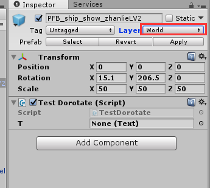
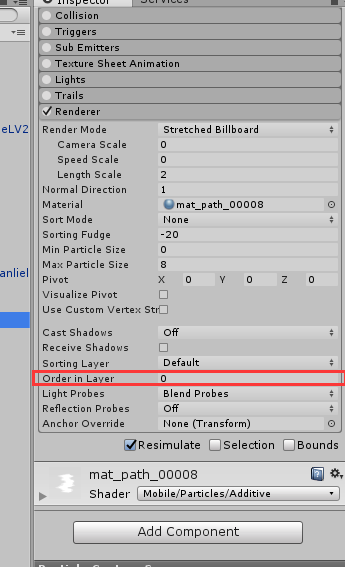

## GameObject
>修改gameobject层级.`gameObject.layer = xx;`即可。  
这里只是修改一个物体的层级，要想递归修改此物体下所有物体的层级怎么做：  

    foreach (Transform tran in obj.GetComponentsInChildren<Transform>(true))
    {
        tran.gameObject.layer = layer;
    }

>修改Render层级(包括mesh的render和粒子的render)

    public static void SetSortingOrderToChildren(this GameObject obj, int order)
    {
        foreach (Renderer render in obj.GetComponentsInChildren<Renderer>(true))
        {
            render.sortingOrder = order;
        }
    }

