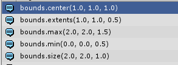
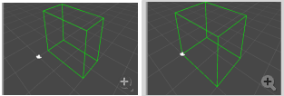
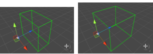

## Bounds

包围盒永远不会旋转。

构造方法：

public **Bounds**([Vector3](https://docs.unity3d.com/ScriptReference/Vector3.html) **center**, [Vector3](https://docs.unity3d.com/ScriptReference/Vector3.html) **size**);

center：中心，size：大小。

```
bounds = new Bounds(Vector3.one, new Vector3(2, 2, 1));
Debug.Log("bounds.center" + bounds.center);  //中心
Debug.Log("bounds.extents" + bounds.extents);//范围：总是size的一半
Debug.Log("bounds.max" + bounds.max); 		//max：最大坐标 总是等于 center+extents
Debug.Log("bounds.min" + bounds.min);		//min：最小坐标 总是等于 center-extents
Debug.Log("bounds.size" + bounds.size);		//大小：总是等于extents的二倍
```




#### 1.Bounds.ClosestPoint

public [Vector3](https://docs.unity3d.com/ScriptReference/Vector3.html) **ClosestPoint**([Vector3](https://docs.unity3d.com/ScriptReference/Vector3.html) **point**);

包围盒上\内 ,距离point最近的点的坐标，如果point在包围盒上\内，则返回point坐标

#### 2.Bounds.Contains

public bool **Contains**([Vector3](https://docs.unity3d.com/ScriptReference/Vector3.html) **point**);

point是否在包围盒上\内 。

#### 3.Bounds.Encapsulate

public void **Encapsulate**([Vector3](https://docs.unity3d.com/ScriptReference/Vector3.html) **point**);

扩大包围盒至包含point

```
bounds = new Bounds(Vector3.one, new Vector3(2, 2, 1));
bounds.Encapsulate(new Vector3(0,0,0));
```



#### 4.Bounds.Expand

public void **Expand**(float **amount**);

public void **Expand**([Vector3](https://docs.unity3d.com/ScriptReference/Vector3.html) **amount**);

center不变，将size增加amount

```
bounds = new Bounds(Vector3.one, new Vector3(2, 2, 1));
bounds.Expand(new Vector3(0,0,1f));
```



####  5.Bounds.IntersectRay

public bool **IntersectRay**([Ray](https://docs.unity3d.com/ScriptReference/Ray.html) **ray**);

射线是否与包围盒相交

#### 6.Bounds.Intersects

public bool **Intersects**([Bounds](https://docs.unity3d.com/ScriptReference/Bounds.html) **bounds**);

两个包围盒是否相交

#### 7.Bounds.SetMinMax

public void **SetMinMax**([Vector3](https://docs.unity3d.com/ScriptReference/Vector3.html) **min**, [Vector3](https://docs.unity3d.com/ScriptReference/Vector3.html) **max**);

通过设置min，max来设置包围盒

#### 8.Bounds.SqrDistance

public float **SqrDistance**([Vector3](https://docs.unity3d.com/ScriptReference/Vector3.html) **point**);

返回point距离包围盒最近距离的平方

