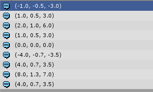

## Bounds
	Bounds bounds =new Bounds(Vector3.zero, new Vector3(2,1,6));
    Debug.Log(bounds.min);
    Debug.Log(bounds.max);
    Debug.Log(bounds.size);
    Debug.Log(bounds.extents);
    bounds.Expand(new Vector3(6, 0.3f, 1));
    Debug.Log(bounds.center);
    Debug.Log(bounds.min);
    Debug.Log(bounds.max);
    Debug.Log(bounds.size);
    Debug.Log(bounds.extents);

结果如图：  
  
extents属性是bounds大小的一半。  
Expand方法会拓展大小  
还一个比较重要的方法  Encapsulate ：  Grows the Bounds to include the point.