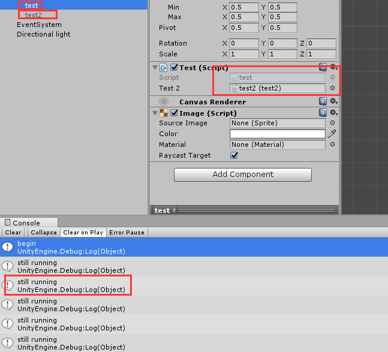

## StartCoroutine
unity中使用某个继承MonoBehaviour的实例启动StartCoroutine时，只要该实例不被destroy或setActive(false)的话，该实例就会一直执行到结束.  

栗子：  

	public class test : MonoBehaviour
	{
	    public test2 test2;
	    void Start()
	    {
	        StartCoroutine(test2.test1());
	    }
	}
	----------------------------
	public class test2 : MonoBehaviour
	{
	    public IEnumerator test1()
	    {
	        Debug.Log("begin");
	        while (true)
	        {
	            yield return new WaitForSeconds(0.5f);
	            Debug.Log("still running");
	        }
	    }
	}

   
这里即使将test2的gameobject设为active false 或者Destory，StartCoroutine仍然是运行的，但是一旦将test设为active false，协程就会立即停止运行。于是如果不想让协程停止的话有种用法是Game.Instance.StartCoroutine(xxxx);  

**所以说：**yield return new WaitForSeconds(0.5f)，这个东西不会在你Destory东西的时候报错，会出现的错误只可能是**协程里有引用被删了**