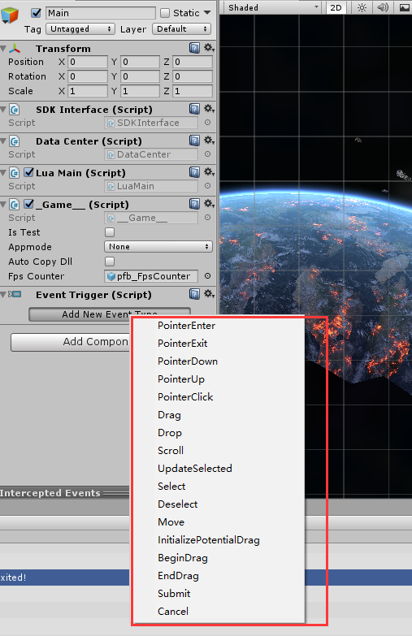
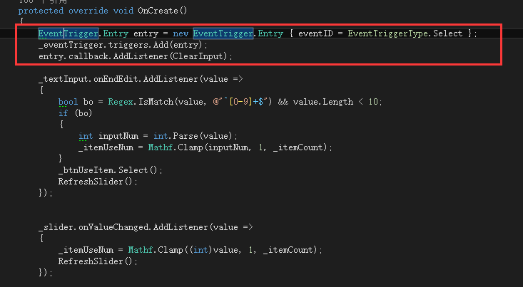

有一些Ugui的时候需要用到下面的事件：  
  
可以在该UI上添加一个eventtrigger。然后添加事件调用的方法。  
  
官网链接  
[https://docs.unity3d.com/ScriptReference/EventSystems.EventTrigger.html](https://docs.unity3d.com/ScriptReference/EventSystems.EventTrigger.html)