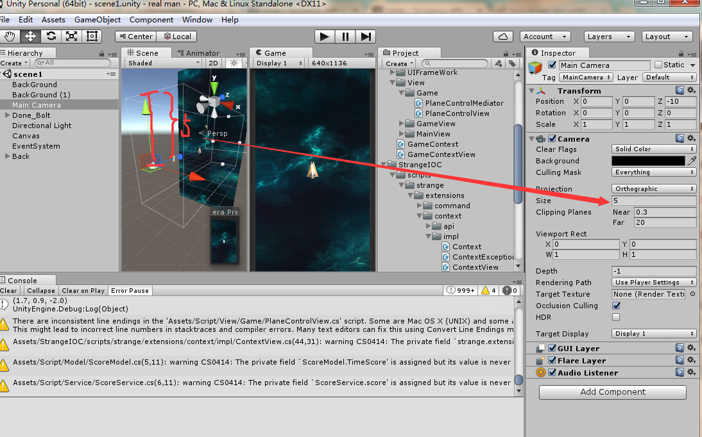

## Camera

### Variables ###
* orthographicSize:Camera's half-size when in orthographic mode.对应世界坐标高度的一半

* aspect:The aspect ratio (width divided by height).宽和高的比例，用orthographicSize乘以aspect即为相机视野大小宽度的一半(世界坐标)。