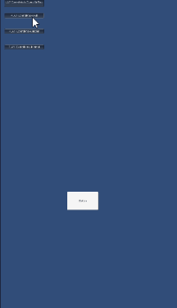
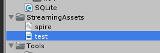
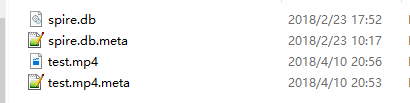

### Handheld 类
文档在[这](https://docs.unity3d.com/ScriptReference/Handheld.html)  
##### Handheld.StartActivityIndicator();  
开启loading标志，  
上代码：  

    Handheld.SetActivityIndicatorStyle(AndroidActivityIndicatorStyle.InversedLarge);
    Handheld.StartActivityIndicator();  
上图：  
  
对！就是显示了右上角这个小玩意，而且也不阻挡触摸(即中间的button按钮还是可以点的)而且还不是在中间。。无语了。就一直在左上角转啊转。  
##### Handheld.StopActivityIndicator();  
对，就是停止上面那个玩意。  
##### Handheld.Vibrate()
官方文档说明，是可以震动一下，但是，我测试并没有震动，推测可能是要配置权限什么的。  
##### Handheld.PlayFullScreenMovie  
唯一一个有趣的东西了  
可以播放视频！！！  
有一些选项和设置。测试代码  

	public class Test : MonoBehaviour {
		void OnGUI()
		{
		    if (GUI.Button (new Rect (20,10,200,50), "PLAY ControlMode.CancelOnTouch")) 
			{
	    	   	Handheld.PlayFullScreenMovie("test.mp4", Color.black, FullScreenMovieControlMode.CancelOnInput);
			}
			if (GUI.Button (new Rect (20,90,200,25), "PLAY ControlMode.Full")) 
			{
	       		Handheld.PlayFullScreenMovie("test.mp4", Color.black, FullScreenMovieControlMode.Full);
			}
			if (GUI.Button (new Rect (20,170,200,25), "PLAY ControlMode.Hidden")) 
			{
	       	 	Handheld.PlayFullScreenMovie("test.mp4", Color.black, FullScreenMovieControlMode.Hidden);	
			}
			if (GUI.Button (new Rect (20,250,200,25), "PLAY ControlMode.Minimal")) 
			{
	       		Handheld.PlayFullScreenMovie("test.mp4", Color.black, FullScreenMovieControlMode.Minimal);
			}
		}
	}
看下手机录屏的一段mp4效果：  

**注意：**  

1. 文件放在StreamingAssets里。  
2. 注意大小写。
3. 调用时直接写名字即可，不要写完整路径。 `Handheld.PlayFullScreenMovie("test.mp4", Color.black, FullScreenMovieControlMode.Full)`