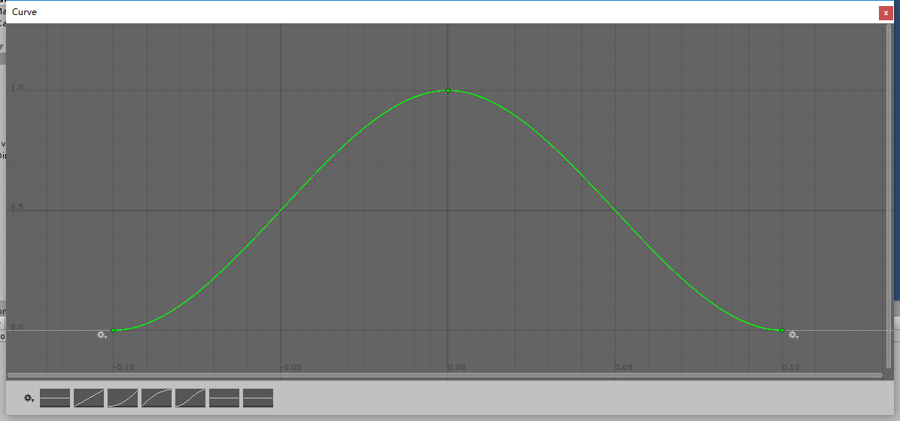

### AnimationCurve
    internal static AnimationCurve DefautCurve
    {
        get
        {
            var curve = new AnimationCurve(
                new Keyframe(-0.1f,0),
                new Keyframe(0f,1),
                new Keyframe(0.1f,0));
            return curve;
        }
    }
通过添加Keyframe和设置KeyFrame状态来控制AnimationCurve  
上述代码结果如图：  
