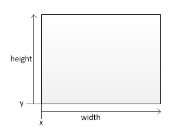
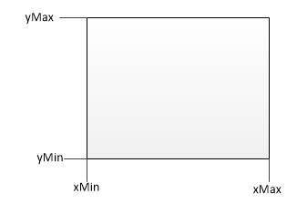

### Rect  

[unity官方文档](https://docs.unity3d.com/ScriptReference/Rect.html)写明GUI和GUILayout 中，y向下是正方向。


RectTransform.Rect里的属性如center,**x,y,min,max,xMin,xMax**...

可以理解成

* 以RectTransform的pivot为原点。y向上是正方向
* min在左下角，max在左上角

也可以理解成官方文档里的

* 以RectTransform的pivot为原点。y向下是正方向

* min在左上角，max在右下角

  

以上两种理解并无本质区别，下面以第一种理解作为例子展示

#### 构造

public **Rect**(float **x**, float **y**, float **width**, float **height**);

设置左下角位置x,y，以及宽高 width,height  

#### 属性

* RectTransform.Rect.(x,y)：取的是以RectTransform的pivot为原点，左下角的相对位置

   

* RectTransform.Rect.position : 即 x,y 位置 **以pivot为原点**

* RectTransform.Rect.(height,width): Rect的高度和宽度

* RectTransform.Rect.size: 即 height,width

* RectTransform.Rect.center: 值为Rect对角线交点相对RectTransform的pivot的位置，设置center会保持宽高不变

* RectTransform.Rect.(xMin,yMin,xMax,yMax) : 

   虽然x和y与xMin和yMin有相同的值(float),但是进行设置时有不同的表现，设置x,y会改变Rect的位置保留大小，而设置xMin,xMax,yMin,yMax会重新设置大小，但是保留另一条对应边的位置。

* Rect. **Set**(float **x**, float **y**, float **width**, float **height**) :重新设置一个rect的位置和宽高

* 特别的 **Contains** rect是否包含某一点，**Overlaps**是否与另一个rect交叠。 **ToString** 打印。

#### 注意：

这里仅是RectTransform里rect的y方向向上为正方向，其他地方使用到是还要验证


下述代码可以让tip框框保持在root框框内

```
        Vector3 pos = tip.localPosition;
 
        Vector3 minPosition = _root.rect.min - tip.rect.min;
        Vector3 maxPosition = _root.rect.max - tip.rect.max;
 
        pos.x = Mathf.Clamp(tip.localPosition.x, minPosition.x, maxPosition.x);
        pos.y = Mathf.Clamp(tip.localPosition.y, minPosition.y, maxPosition.y);
 
        tip.localPosition = pos;
```

 

