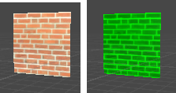

### Material

材质可以理解成shader的一个实例，可以设置shader里的Properties的数值

##### Properties

* color：相当于使用GetColor or SetColor 方法 参数名传"_Color" 
* mainTexture：相当于使用GetTexture or SetTexture with "_MainTex" name.

##### Public Methods

* SetColor(string name,Color value)：对shader->Properties里名为name的属性设置为颜色value。

  例：`_material.SetColor("_Color",Color.green);`

  运行前后对比:

  

  如果这个“_Color”字段shader没有定义也不会报错，只是这行语句就相当于没有作用。

* GetColor(string name)：获取对shader->Properties里名为name的颜色属性的值

  shader里没有对应名称的Color类型的字段，会提示错误，但程序会继续运行。

* GetTexture(string name)：获取对shader->Properties里名为name的Texture属性的值

