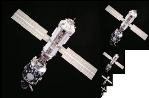
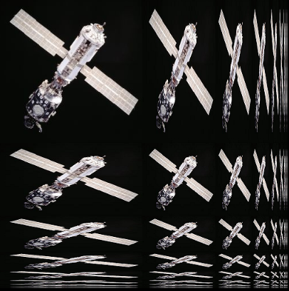
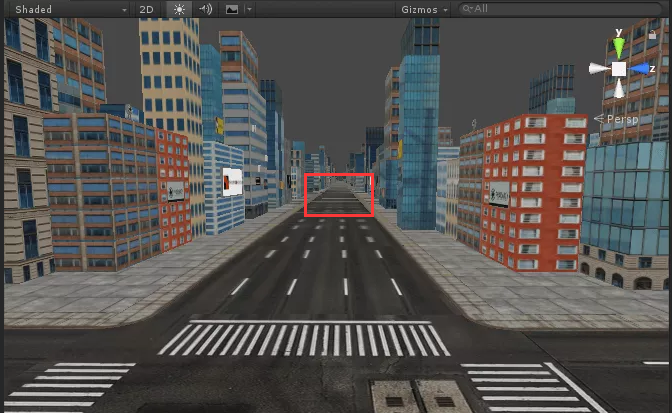
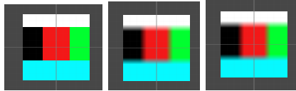
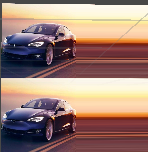

### Texture

##### Properties

* mipMapBias：参考[TextureImporter.mipmapEnabled](34.TextureImporter.md),一般生成mipmap，都是长宽减半，1024x1024的图片下一级mipmap是512x512，通过设置mipMapBias可以调整下一级mipmap是大于512还是小于512的偏移尺度。(可以通过代码将TextureImporter的inspector面板调成debug模式来改版该值)

  示例如图

  

* anisoLevel：Texture各向异性过滤级别。如图：可以看到，比mipmap更消耗内存,TextureImporter面板可以修改等级

  

  对于不同方向使用不同的采样率，这种情况多用于图片有倾斜角度导致长宽比与原纹理相差较大的情况，如

  

* dimension：一个type，表明该纹理是什么类型的(只读)

* FilterMode：Filter Mode 当该纹理由于3D变换进行拉伸时，它将如何被过滤插值。共有三种选择：

  * Point 单点插值，纹理将变得块状化（blocky up close）；
  * Bilinear 双线性插值，纹理将变得模糊（blurry up close）；
  * Trilinear 三线性插值，类似Bilinear，但是纹理还会在不同的mip水平之间（between the different mip levels）进行模糊；

  如下图，一个10x10像素的图片被拉伸之后展示到屏幕时的情况，分别是Point/Bilinear/Trilinear 的情况

  

* height：纹理高多少像素(只读)

* width：纹理宽是多少像素(只读)

* imageContentsHash：Texture的哈希值128bit，即使Texture有微小的变化也会导致哈希值不同，如果一些设置改变了Texture(大小或像素)，的比如生成了mipmap或者改变了压缩格式，unity都会重新重新计算哈希值。(虽然原始文件不变，但是unity会根据不同的设置生成不同的Texture)

* isReadable：当该Texture Importer 的Inspector面板勾选[Read/Write Enabled](../Manual/12.Texture Importer.md)时返回true。通过脚本创建的Texture总是返回true。

* updateCount：当Texture更新时会自增。

* wrapMode：纹理坐标的换行模式。[参考](../Shader/13.Tilling and offset.md)

  设置该模式实际上影响的是shader中使用的unity内置的取纹理颜色的函数tex2D(纹理,坐标)。

  * Repeat：
  * Clamp：
  * Mirror：
  * MirrorOnce：仅在纹理坐标x∈(-1,0),y∈(-1,0)翻转一次
  
* wrapModeU：单独设置U轴方向的换行模式.

* wrapModeV：单独设置V轴方向的换行模式.

  如下则是wrapModeU设为Clamp，wrapModeV设为Repeat的结果：

  

* wrapModeW：为Texture3D设置w轴换行模式

