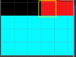
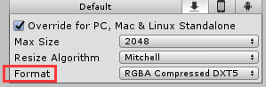

### Texture2D

##### Public Methods

使用一些**获取或设置**像素的方法需要勾选Texture的[Read/Write Enabled](../Manual/12.Texture Importer.md)选项。

* GetPixel：

  * public  Color GetPixel(int x, int y)

  * 获取x,y坐标的像素颜色。左下角为原点，索引从0,0开始，如下图GetPixel(3,3)取到的就是红色。

    

  * 如果坐标超边界，那么会根据TextureImporter里wrap mode设置的clamped或者repeated取像素。[参考](../Shader/13.Tilling and offset.md)

  * 使用Crunch 压缩格式时，不可使用(测试是可以获取到像素值的，不知道什么原因)

* SetPixel：

  * public void SetPixel(int x, int y, Color color);
  * 设置x,y坐标像素的颜色为color。
  * 需要调用Texture2D.Apply应用更改。

* Apply()：

  * public void Apply(bool updateMipmaps = true, bool makeNoLongerReadable = false);

  * updateMipmaps ：是否重新计算mipmap，默认是true重新生成，设置为false和true的对比情况如下

    

  * makeNoLongerReadable：不再可读，设为true时，apply后改Texture就不可以再读写了。(调用GetPixel等函数会报错)。但好处是不用在再cpu放一份副本用于修改了。[参考](../Manual/12.Texture Importer.md)
  * Apply操作是非常耗费性能的，最好是等所有的更改都设置好之后Apply一次，即使这些设置是在运行是设置的，结束运行会到Editor时依然会生效。

##### Properties

* format：返回纹理的格式。
* 