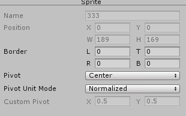
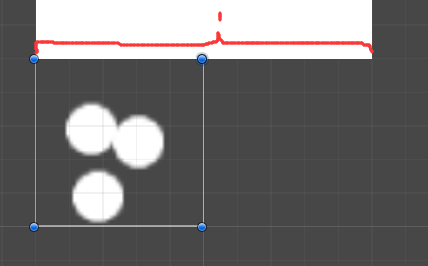
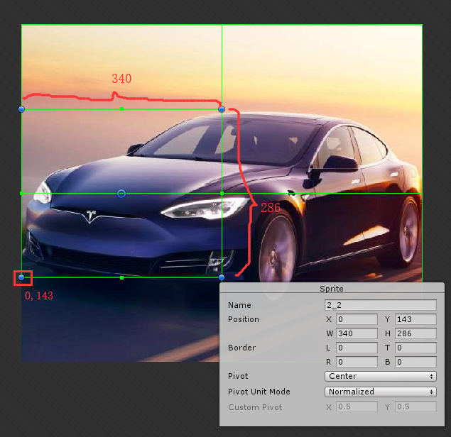
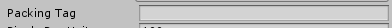
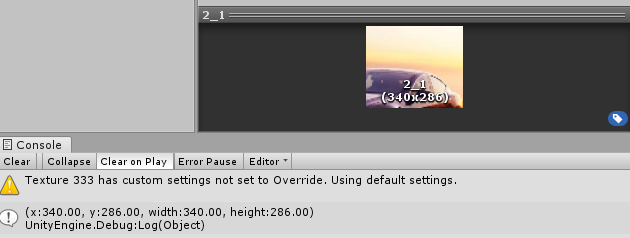
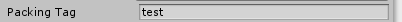
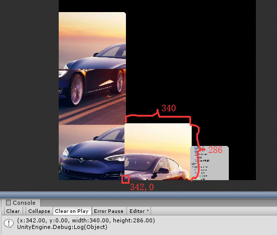

#### Sprite

##### Propertie:

* associatedAlphaSplitTexture：

* border：可以在Sprite Editor 中设置

* bounds：

* packed：是否被打包进图集，TextureImporter -> Packing Tag

* packingMode：TextureImporter -> Mesh Type 返回Tight或者Rectangle

* packingRotation：打包进图集后图片的旋转角度？

* pivot：重心的坐标，图片左下角坐标为(0,0)。如果Pivot设置为Center，则重心坐标为(图片像素宽/2,图片像素高/2)，即一个50*50的图片，Pivot坐标为(25,25)。TextureImporter->Pivot设置

* pixelsPerUnit：一个世界单位对应多少像素点，一般设置为100，即一个单位对应100个像素点，所以一个50*50的图片长度为世界单位的一半。如图 

  TextureImporter->Pixels Per Unit设置

* rect：位于原纹理图的坐标, 单位是像素

  * Sprite可以是原纹理切成的多图中的一个(Sprite Mode 选Multiple，然后打开Sprite Editor切图)。

  * rect的x,y就是该Sprite(左下角)位于原纹理(左下角)的偏移的坐标。如下图的(0,143)

  * rect的width，height，就是(340,286)(像素)

  * 可以看到切图是可以有重叠部分的

  * 如果没有切图，那么rect的width，height应该等于纹理Texture的[width](33.Texture.md)，和[height](33.Texture.md)

    

* texture：返回该Sprite来源的纹理，如果该纹理没有打包进图集则指向该纹理，如果打包进图集则指向图集。

* textureRect：类似与上面的texture，如果没有打包图集，则返回的是该Sprite在原纹理的rect坐标，与rect值相同，如果打包成图集则是该Sprite在图集纹理的rect坐标。

  * Mesh Type 需要设置为Full Rect，如果是Tight则返回异常(全返回0)

  例：不设置Tag

  右上的图textureRect结果为：

  设置Tag：

  右上的图textureRect结果为：

  

* textureRectOffset：？

对于一个3D物体的渲染,(vertices,triangles,normals,tangents,uv)的集合就是一个Mesh文件,texture和shader的集合就是一个Material文件.

对于2D物体的渲染,由于不考虑光照问题,所以把 vertices,triangles,uv,texture 放在一起就是一个Sprite文件 , 而Material中只需要包含一个Shader即可

* triangles：
* uv：
* vertices：

