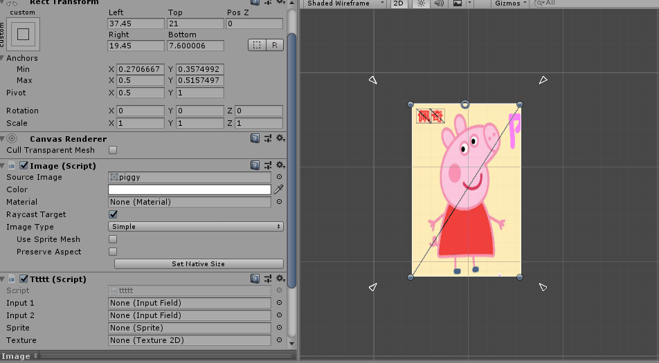

#### RectTransformUtility

一个RectTransform的工具类，只有几个静态方法

##### Static Functions

* FlipLayoutAxes：交换x，y数值

  * public static void FlipLayoutAxes(RectTransform rect, bool keepPositioning, bool recursive);

  * 源码：

    ```
    public static void FlipLayoutAxes(RectTransform rect, bool keepPositioning, bool recursive)
    {
        if (rect == null)
            return;
    
        if (recursive)
        {
            for (int i = 0; i < rect.childCount; i++)
            {
                RectTransform childRect = rect.GetChild(i) as RectTransform;
                if (childRect != null)
                    FlipLayoutAxes(childRect, false, true);
            }
        }
    
        rect.pivot = GetTransposed(rect.pivot);
        rect.sizeDelta = GetTransposed(rect.sizeDelta);
    
        if (keepPositioning)
            return;
    
        rect.anchoredPosition = GetTransposed(rect.anchoredPosition);
        rect.anchorMin = GetTransposed(rect.anchorMin);
        rect.anchorMax = GetTransposed(rect.anchorMax);
    }
    
    private static Vector2 GetTransposed(Vector2 input)
    {
        return new Vector2(input.y, input.x);
    }
    ```

  * rect：需要翻转的RectTransform 

  * keepPositioning：如果置为false会同时交换anchoredPosition，anchorMin，anchorMax里的xy值

  * recursive：是否顺带旋转child

  * 示例：

* FlipLayoutOnAxis：类似上面的方法只不过是对一个轴操作，该轴的重心，变为pivot[axis]

  * ```
    public static void FlipLayoutOnAxis(RectTransform rect, int axis, bool keepPositioning, bool recursive)
    {
        if (rect == null)
            return;
    
        if (recursive)
        {
            for (int i = 0; i < rect.childCount; i++)
            {
                RectTransform childRect = rect.GetChild(i) as RectTransform;
                if (childRect != null)
                    FlipLayoutOnAxis(childRect, axis, false, true);
            }
        }
    
        Vector2 pivot = rect.pivot;
        pivot[axis] = 1.0f - pivot[axis];
        rect.pivot = pivot;
    
        if (keepPositioning)
            return;
    
        Vector2 anchoredPosition = rect.anchoredPosition;
        anchoredPosition[axis] = -anchoredPosition[axis];
        rect.anchoredPosition = anchoredPosition;
    
        Vector2 anchorMin = rect.anchorMin;
        Vector2 anchorMax = rect.anchorMax;
        float temp = anchorMin[axis];
        anchorMin[axis] = 1 - anchorMax[axis];
        anchorMax[axis] = 1 - temp;
        rect.anchorMin = anchorMin;
        rect.anchorMax = anchorMax;
    }
    ```

* PixelAdjustPoint：？

  * public static Vector2 PixelAdjustPoint(Vector2 point, Transform elementTransform, Canvas canvas);

* PixelAdjustRect：？