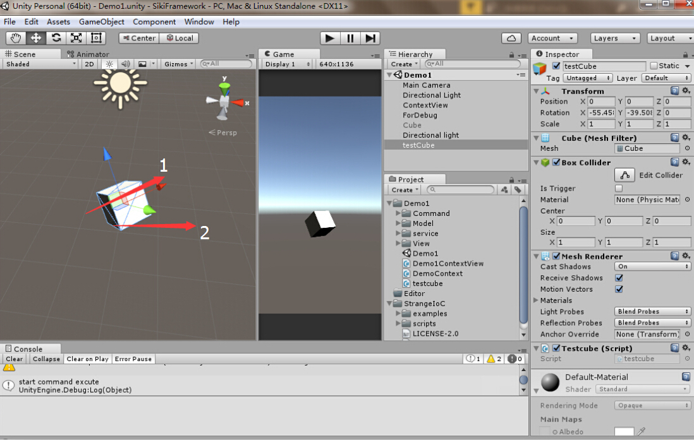

## translate and rotate
#### transform.Translate ####
> transform.Translate是比较常用的一个位置移动的API
如下图的三个调用

	public GameObject refer;
	// Update is called once per frame
	void Update () {
		transform.Translate(new Vector3(0.01f, 0, 0), Space.Self);

	    transform.Translate(new Vector3(0.01f,0,0),Space.World);
	    
	    transform.Translate(new Vector3(0.01f, 0, 0), refer.transform);
	}

>* `transform.Translate(new Vector3(0.01f, 0, 0), Space.Self);`每帧以自身为坐标系的x轴方向移动0.01米,为图中的方向1
>* `transform.Translate(new Vector3(0.01f, 0, 0), Space.World);`每帧向世界坐标系的x轴方向移动0.01米,为图中的方向2
>* `transform.Translate(new Vector3(0.01f, 0, 0), refer.transform);`以GameObject refer为参考坐标(即下图中的长方体),为下图中的方向3，如果需要子弹发射的功能，这个会很方便

当然调用也可以使用下面的方式：  
	 Translate(float x, float y, float z, Transform relativeTo);

#### Rotate ####
同理

	public void Rotate(Vector3 eulerAngles, Space relativeTo = Space.Self);