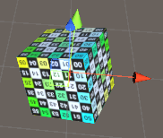

## translate and rotate
#### transform.Translate ####
> transform.Translate是比较常用的一个位置移动的API
如下图的三个调用

	public GameObject refer;
	// Update is called once per frame
	void Update () {
		transform.Translate(new Vector3(0.01f, 0, 0), Space.Self);
	
	    transform.Translate(new Vector3(0.01f,0,0),Space.World);
	    
	    transform.Translate(new Vector3(0.01f, 0, 0), refer.transform);
	}

>* `transform.Translate(new Vector3(0.01f, 0, 0), Space.Self);`每帧以自身为坐标系的x轴方向移动0.01米,为图中的方向1
>* `transform.Translate(new Vector3(0.01f, 0, 0), Space.World);`每帧向世界坐标系的x轴方向移动0.01米,为图中的方向2
>* `transform.Translate(new Vector3(0.01f, 0, 0), refer.transform);`以GameObject refer为参考坐标(即下图中的长方体),为下图中的方向3，如果需要子弹发射的功能，这个会很方便

当然调用也可以使用下面的方式：  
	 Translate(float x, float y, float z, Transform relativeTo);

#### Rotate ####

unity的Rotate接口都是**旋转自身**

大致分为两种

* 以**某个向量为旋转轴**(axis)，旋转自身一个度数(angle)，方向使用**左手定则**(左手握住坐标轴，四指为旋转方向)

  这个旋转轴是以自身中心为起点，指示的一个方向，

  

  * 如接口：Rotate(Vector3 axis, float angle); 这个接口默认axis的参考系为Space.Self

	* 示例：每帧绕旋转轴Vector3(1,1,1)，旋转1度，transform.Rotate(new Vector3(1,1,1),1);
	
	* 
	
	* 与transform.Translate接口类似，Rotate接口也可以**指定坐标轴的参考空间**
	
	  * 如果，使用Rotate(Vector3 axis, float angle, Space.Self);
	
	    则axis的方向是以自身坐标为参考系的方向
	
	    
	
	  * 如果，使用Rotate(Vector3 axis, float angle, Space.World);
	
	    则axis的方向是以世界坐标为参考系的方向
	
	    
	
	    这时候如果取Vector3(1,1,1)肯定是和Space.Self是不同的。
	
* 还有一种**直接旋转**接口为，Rotate(float xAngle, float yAngle, float zAngle) 或Rotate(Vector3 eulers)，这个接口默认axis的参考系为Space.Self

  * 可以理解为 

    1. 记录自身坐标轴指向$x_1,y_1,z_1$，
    2. 绕$z_1$轴旋转zAngle度
    3. 绕$x_1$轴旋转xAngle度
    4. 绕$y_1$旋转yAngle度
    5. 更新新的坐标轴指向

    这里注意虽然绕$z_1$轴旋转zAngle度后物体自身xy轴也会改变，但是我们是将2,3,4步看作一个整体的变换，**使用的都是原来的$x_1,y_1,z_1$**

  * 如果这两个接口在后面指定参考坐标系为Space.World。

    则 $x_1,y_1,z_1$的轴为世界坐标轴方向，针对的依然是自身的旋转。

  

