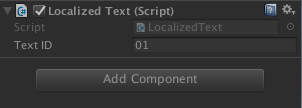

## Editor 编辑器
#### 1. RequireComponent
	[RequireComponent(typeof(Text))]
	public class LocalizedText : MonoBehaviour
	{
		private Text _label;
		public void Start ()
		{
			_label = GetComponent<Text>();
			SetupTextID(_textID);
		}
	｝
上述代码中总是需要获取Gameobject下的**Text**组件，为了防止我们忘记添加这个组件可以加上**[RequireComponent(typeof(Text))]**。  
##### 作用
* 将脚本拖至GameObject上时，如果GameObject上没有RequireComponent里的组件，会自动添加此组件。有则不做操作。
* 而且使用后RequireComponent，这个被需要的组件是不可以被删除的。除非先移除这个脚本，再移除这个组件。
 
#### 2.SerializeField
序列化私有域可以使其在Inspector窗口里展现出来  
 
	[SerializeField]
	private string _textID;
