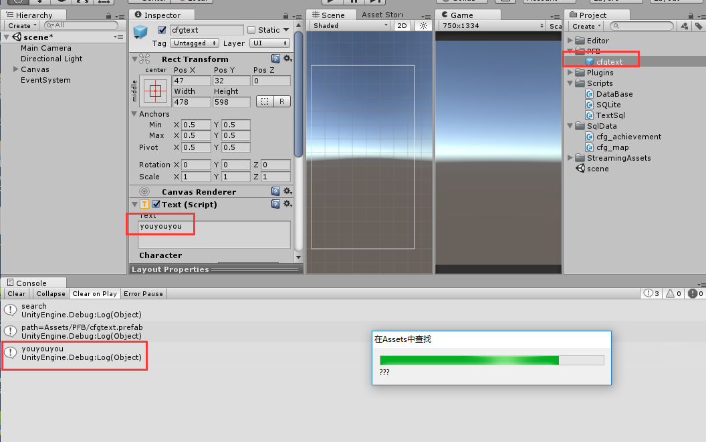
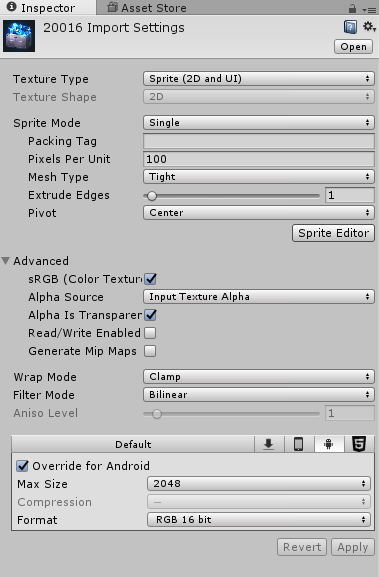
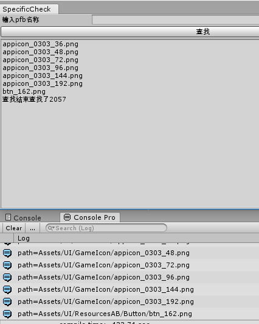

## AssetDatabase  
Editor在unity中对于文件的操作(导入，设置，加载等等)不推荐使用c#自带的filesystem(.IO)而是使用[AssetDatabase](https://docs.unity3d.com/ScriptReference/AssetDatabase.html)里的接口。最后还要记得AssetDatabase.Refresh()一下。  
下面就我接触到的几个api的使用做一个简单说明。   
 
* AssetDatabase.FindAssets  
* AssetDatabase.GUIDToAssetPath 
* AssetDatabase.LoadAssetAtPath  

上面三个api组合在一起是一个组合技。  
**举个栗子：**  

	using UnityEditor;
	using UnityEngine.UI;
	using UnityEngine;
	
	public static class TestAssetDatabase{
	    [MenuItem("TestAssetSearch/test")]
	    public static void SearchSomething()
	    {
	        Debug.Log("search");
	        EditorUtility.DisplayProgressBar("在Assets中查找", "开始查找", 0);
	        var guids = AssetDatabase.FindAssets("cfg t:GameObject");
	        for (int i = 0; i < guids.Length; i++)
	        {
	//            Debug.Log("guid=" + guids[i]);
	            string path = AssetDatabase.GUIDToAssetPath(guids[i]);
	            Debug.Log("path=" + path);
	            GameObject obj = AssetDatabase.LoadAssetAtPath<GameObject>(path);
	            Text t = obj.GetComponent<Text>();
	            Debug.Log(t.text);
	        }
	
	        EditorUtility.DisplayProgressBar("在Assets中查找", "???", 0.8f);
	        EditorUtility.ClearProgressBar();
	    }
	}
  
>AssetDatabase.FindAssets返回guids，AssetDatabase.GUIDToAssetPath根据guid找到路径,AssetDatabase.LoadAssetAtPath根据路径加载预设,最后获取GameObject某个组件。  

>AssetDatabase.FindAssets参数，t: 代表type,上述代码如果没设置type则会把SqlData文件夹下的两个含"cfg_xxx"名字的一起找到，其他的标签还有Labels和Name可选。详细api见[官网](https://docs.unity3d.com/ScriptReference/AssetDatabase.FindAssets.html).

>上述一串代码实现了查找已经做好的pfb中文本文字的功能。当然也可以查找到自己挂在pfb脚本上某个序列化好的参数。更完善的接口在cs代码文件夹下。另外图中的进度条是EditorUtility.DisplayProgressBar()的使用。  

### 2.有个栗子  
该栗子放在cs文件夹里，用于查找特定pfb包含有text组件却没有QuickLocalize组件的GameObject。  
当然代码稍微改动下就可以进行对pfb的批量操作(修改rectTransform长宽)，不过操作之前要先保存哦。  

    private static void Check()
    {
        note = string.Empty;
        var guids = AssetDatabase.FindAssets(filter);
        if (guids.Length == 0)
            note = "未找到pfb:" + myString;
        for (int i = 0; i < guids.Length; i++)
        {
            //            Debug.Log("guid=" + guids[i]);
            string path = AssetDatabase.GUIDToAssetPath(guids[i]);
            Debug.Log("path=" + path);
            GameObject obj = AssetDatabase.LoadAssetAtPath<GameObject>(path);
	//      Text[] t = obj.GetComponentsInChildren<Text>(true);
	//      for (int j = 0; j < t.Length; j++)
	//      {
	//          if (t[j] != null)
	//          {
	//              Debug.Log("检查：" + t[j].text);
	//              QuickLocalize quick = t[j].GetComponent<QuickLocalize>();
	//              if (quick == null)
	//              {
	//                  note +=t[j].name+":"+ t[j].text + "\n";
	//              }
	//          }
	//      }
			//上面被注释的几行是查找是否挂了QuickLocalize组件
			//下面几行是修改RectTransform的大小
            Transform model = obj.transform.Find("MailTab2/SuccessView/Viewport/Content/03/Viewport/Content/ListItemModel1");
            RectTransform[] rects = model.GetComponentsInChildren<RectTransform>();
            for (int j = 0; j < rects.Length; j++)
            {
                rects[j].sizeDelta = new Vector2((int)rects[j].sizeDelta.x * 0.8f, (int)rects[j].sizeDelta.y * 0.8f);
            }

        }
        note += "查找结束";
    }
3.还有栗子：  
这个栗子是为了批量修改图片的Import Setting(此设置存在图片meta文件里)如下  
  
核心代码：  

    string path = AssetDatabase.GUIDToAssetPath(guids[i]);
    TextureImporter ti = (TextureImporter)AssetImporter.GetAtPath(path);
    string  platformString = "Android";
    if(ti.GetPlatformTextureSettings(platformString).format==TextureImporterFormat.RGBA32)
    {
        note = note + Path.GetFileName(path) + "\n";
        Debug.Log("path=" + path);
    }
查找结果：  
  
可以看到btn_162.png图有点不正常。
PS:完整代码放在cs文件夹SpecificCheck2里