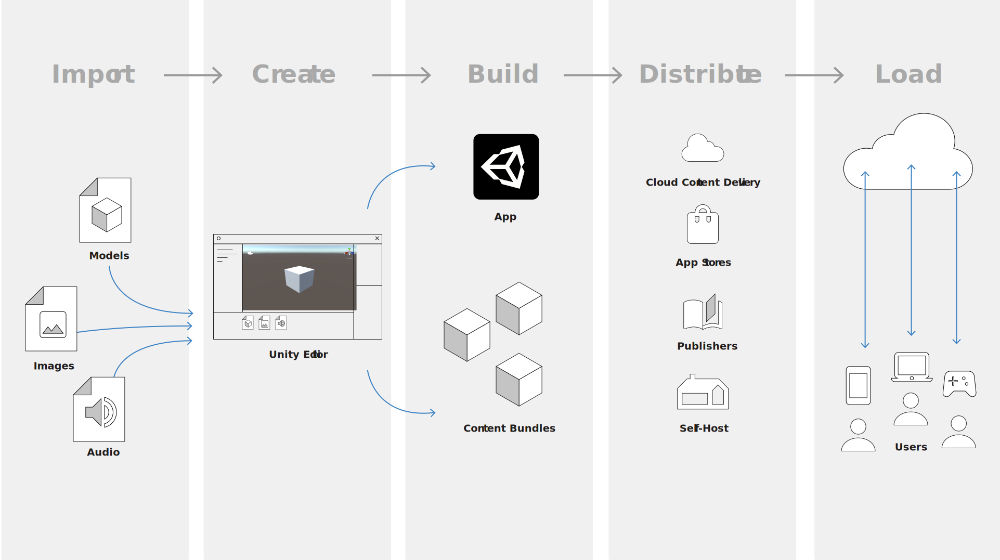

unity的资产工作流程

1.资产是什么

资产是你使用Unity project去创建游戏或应用的**任何东西**。资产是你工程中的视觉资料或声音元素，如3D 模型，纹理，精灵，音效，音乐。资产也可以代表一个更加抽象的东西，比如颜色演变，动画遮罩，任何文本，数值数据

2.资产来源

一个资产可以是从Unity**外部**创建的文件，如3D 模型，音源，或者图片。也可以创建Unity**自有**的一些**资产类型**，如 ProBuilder Mesh, Animator Controller, Audio Mixer, Render Texture。

整个流程如下图

资源导入后，Unity会二次处理成资产，打包成资产包供app使用， 然后发布到平台。玩家可以到对应平台下载。

#### Import

当保存或者拷贝一个文件到Assets文件夹下时，Unity会导入这些文件。

可以参考 [Importing Assets](https://docs.unity3d.com/Manual/ImportingAssets.html)学习导入的**基础**，如：文件储存在工程哪里，如何为每种资产设置**import setting**，**meta**文件是做什么的。**Asset Database**如何储存导入的数据。

可以使用[Unity Accelerator](https://docs.unity3d.com/Manual/UnityAccelerator.html).进行团队协作

#### Create

当你工程中导入了一些资产，你可以开始创建游戏了。这通常涉及将资产作为GameObjects放到一个或多个场景，然后添加脚本控制他们的交互。

随着项目规模增长，你可能需要将资产**拆分到不同的组**，以便游戏可以在运行中增量的下载不同内容。

在创建的过程中，需要决定一个**资产分组策略**，然后使用代码实现**何时加载**。

将**资产分组打包**可以**减少初始体积**，然后在游戏**运行时加载**。参照 [Addressables](https://docs.unity3d.com/Manual/com.unity.addressables.html)

#### Build

组建就是将你工程文件**导出**成**二进制文件**。然后你可以选择在某个平台发布和运行。例如，在Windows，Unity生成`.EXE`文件，和一些数据文件，然后你就可以发布了。

如果你是用Addressables 或者Asset Bundles 将资产分组打成可以下载的包，你还需要**组建这些资产包**

你可以使用你自己的电脑组建，或者使用Unity's 的云组建服务[Cloud Build service](https://docs.unity3d.com/Manual/UnityCloudBuild.html) 。该服务提供了自动生成和持续整合功能。

#### Distribute

组建好了app和它附带的资产包，用户需要途径去下载，发布方法取决于你选择的平台。

如：手机平台有自己的app 应用商店，你可以使用专业的发布，或者只放到自己的服务器上。unity 提供了他自己的[Cloud Content Delivery](https://docs.unity3d.com/Manual/UnityCCD.html) 云端的资源分发系统。可以让你控制内容的发布，集成了unity的所有开发平台。为内容丰富，实时游戏，或者需要定期更新内容的游戏节省大量时间。

#### Load

当玩家下载和使用app，加载进程取决于你的代码规则，和你资产的分组和打包方式。

使用这里的技术和服务，你可以在整个项目周期提供更快的初始下载，持续的更新，额外的游戏内容

### Artist workflow  的好处

工具和特性让编辑和设计unity的资产工作流在Unity Editor中变得非常简单。

* 支持多种文件格式 (png，svg...)

* Unity和第三方工具的快速转换？
* 预先自定义不同资产的设置
* 使用Addressables和Cloud Content Delivery 更新内容

#### Programmer workflow 的好处

* 定制内容管线，例如，unity导入资产的时候可以使用你自己写的脚本去处理。或者按照自己的规则应用一些预设。
* 通过脚本更新资产，用代码调整例如材质，网格，和物理
* 使用可寻址的资产系统 [Addressable assets system](https://docs.unity3d.com/Manual/com.unity.addressables.html)可以节省内存，简化复杂工程的文件管理，提供自动化内存管理和分析工具。
* 优化目标平台的资产大小，当你做一个多平台的工程，里面可能有几百个不同的纹理需要对不同的平台使用不同的打包方案。Unity packages会在你为不同平台打包时自动调整尺寸和重新压缩你的资产。

#### 工作流的考量 Workflow considerations

使用Unity时可以有不同的策略去安排资产。什么是适合的策略取决于多种因素比如你团队的大小，工程的大小，目标平台和目标平台的内存，你是否想在发布后更新补丁和DLC等。

可以使用 [Cache Server](https://docs.unity3d.com/Manual/UnityAccelerator.html)作为版本管理系统减少迭代时间。

如果工程有大量资产，然后你想将它作为独立的资产包发布，为一些资产创建一个单独的project也许是个好办法，这样团队成员在处理自己部分的资产包的时候就不用载入整个大工程。

#### 平台的考量  Platform considerations

如果所有资产在同一工程里，Unity会在组建时以当前选定平台的正确格式生成它们。但是，如果您在多个项目中拆分资产以分别构建资产包，则必须为您支持的每个平台分别进行构建。有关更多信息，请参阅多平台的可寻址文档构建。 [Building for multiple platforms](https://docs.unity3d.com/Packages/com.unity.addressables@latest?subfolder=/manual/AddressableAssetsGettingStarted.html%23building-for-multiple-platforms) 

平台的特点决定了运行时管理资产的限制和可能性，如，在PC和macOS，虚拟内存提供了一个几乎没有边界的内存池，所以使用 [Resources folder](https://docs.unity3d.com/Manual/SpecialFolders.html#Resources) 或者大的资产包不会带来显著的内存问题，相反，手机和主机平台成成有限制没有虚拟内存，所以apps在这些平台就要更有效的管理资产的加载和卸载

用户对每个平台不同的预期也需要考虑，比如，手机平台的长时间加载和安装进程会让玩家在玩之前就放弃。所以现在手机平台普遍在最初的组建时只放能支持运行的最小资产包，然后在玩家第一次运行时连接远程服务器下载剩余资产。

