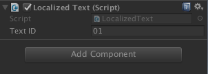

## Editor 编辑器
#### 1. RequireComponent
	[RequireComponent(typeof(Text))]
	public class LocalizedText : MonoBehaviour
	{
		private Text _label;
		public void Start ()
		{
			_label = GetComponent<Text>();
			SetupTextID(_textID);
		}
	｝
上述代码中总是需要获取Gameobject下的**Text**组件，为了防止我们忘记添加这个组件可以加上**[RequireComponent(typeof(Text))]**。  
##### 作用
* 将脚本拖至GameObject上时，如果GameObject上没有RequireComponent里的组件，会自动添加此组件。有则不做操作。
* 而且使用后RequireComponent，这个被需要的组件是不可以被删除的。除非先移除这个脚本，再移除这个组件。
 
#### 2.SerializeField
序列化私有域可以使其在Inspector窗口里展现出来  
 
	[SerializeField]
	private string _textID;
  
#### 3. HideInInspector
与上面一个相反
#### 4.Editor.target ####
The object being inspected.  
For editors that support multi-object editing, the target property should not be used inside OnInspectorGUI since it only refers to the first of the edited objects. It should still be used in OnSceneGUI and OnPreviewGUI, which will be called once for each of the selected objects with the target property referring to each of them in turn.  
such as:  

	void OnSceneGUI ()
	    {
	        //得到test脚本的对象
	        DebuggingGui test = (DebuggingGui)target;
	
	        //开始绘制GUI
	        Handles.BeginGUI();
	        GUILayout.BeginArea(new Rect(0, 0, Screen.width, Screen.height));
	        GUILayout.BeginVertical("box");
	        if (GUILayout.Button("死掉", GUILayout.Width(Screen.width / 10), GUILayout.Height(Screen.height / 20)))
	        {
	            Debug.Log("死掉");
	        }
	        GUILayout.BeginVertical();
	        GUILayout.EndArea();
	        Handles.EndGUI();
	    }