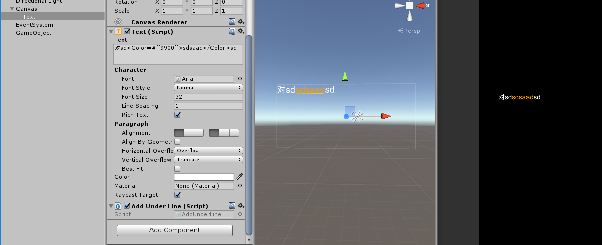

## UGUI添加下划线
#### 1.完美解决版： ####
cs/Text4Coord1.cs  
通过重写Text添加下划线并且匹配颜色。(继承click接口可用于点击后的坐标跳转).  一个字符四个顶点，顺序为逆时针 0->1->2->3
#### 2.有bug版 ####
通过重写ModifyMesh方法对顶点进行操作。但是在处理顶点时，一个字符搞成了6个顶点行数一多会有问题存在，建议使用上面的版本。

如图：  
  
原理是AddUnderLine脚本添加四个顶点，然后设置纹理信息后绘制出来。四个顶点的位置是根据color标签里文字的左下角和右下角顶点位置以及字体大小作为宽度参考得出的。所以遇到换行情况是不能够识别的。下划线颜色也是写死在代码里的。  
代码：  

	using UnityEngine;
	using System.Collections.Generic;
	using System.Text.RegularExpressions;
	using UnityEngine.UI;
	public class AddUnderLine : BaseMeshEffect
	{
	    private Text _text;
	    private static readonly Regex _inputRegex = new Regex(@"<Color.*?Color>", RegexOptions.Singleline);
	    readonly UIVertex[] m_TempVerts = new UIVertex[4];
	    private int _startIndex;
	    private int _endIndex;
	    private int _fontSize;
	    public override void ModifyMesh(VertexHelper vh)
	    {
	        if (!IsActive())
	            return;
	
	        if (_text==null)
	        {
	            _text = GetComponent<Text>();
	        }
	        if (  _text.fontSize!=_fontSize )
	        {
	            _fontSize = _text.fontSize;
	        }
	        MatchCollection matchs = _inputRegex.Matches(_text.text);
	        if (matchs.Count > 0)
	        {
	            foreach (Match match in _inputRegex.Matches(_text.text))
	            {
	                _startIndex = match.Index*6 + 1;
	                _endIndex = (match.Value.Length)*6 + _startIndex - 1;
	            }
	
	            List<UIVertex> vertexList = new List<UIVertex>();
	            vh.GetUIVertexStream(vertexList);
	//        ModifyVertices(vertexList);
	
	            vh.Clear();
	            vh.AddUIVertexTriangleStream(vertexList);
	            SetUnderLine(vertexList, vh);
	        }
	    }
	
	    void SetUnderLine(List<UIVertex> vertexList, VertexHelper vh)
	    {
	
	        int count = vertexList.Count;
	        if (count > 0)
	        {
	            float bottomY = vertexList[_startIndex].position.y;
	            float topY = vertexList[_startIndex].position.y;
	
	            float leftX = vertexList[_startIndex].position.x;
	            float rightX = vertexList[_startIndex].position.x;
	
	            for (int i = _startIndex; i < _endIndex; i++)
	            {
	                float y = vertexList[i].position.y;
	                if (y > topY)
	                {
	                    topY = y;
	                }
	                else if (y < bottomY)
	                {
	                    bottomY = y;
	                }
	
	
	                float x = vertexList[i].position.x;
	                if (x > rightX)
	                {
	                    rightX = x;
	                }
	                else if (x < leftX)
	                {
	                    leftX = x;
	                }
	            }
	            //计算下划线的位置
	            TextGenerator _UnderlineText = new TextGenerator();
	            _UnderlineText.Populate("|", _text.GetGenerationSettings(new Vector2(0, 0)));
	            IList<UIVertex> _TUT = _UnderlineText.verts;
	            Vector3[] _ulPos = new Vector3[4];
	            _ulPos[0] = new Vector3(leftX, bottomY, 0);
	            _ulPos[1] = new Vector3(leftX, bottomY - _fontSize/10f, 0);
	            _ulPos[2] = new Vector3(rightX, bottomY - _fontSize / 10f, 0);
	            _ulPos[3] = new Vector3(rightX, bottomY, 0);
	//            Debug.Log("_startIndex=" + _startIndex);
	//            Debug.Log("_endIndex=" + _endIndex);
	            //绘制下划线
	            for (int j = 0; j < 4; j++)
	            {
	                m_TempVerts[j] = _TUT[j];
	                m_TempVerts[j].position = _ulPos[j];
	                Debug.Log(m_TempVerts[j].position);
	                m_TempVerts[j].color = Color.yellow;
	                if (j == 3)
	                {
	                    vh.AddUIVertexQuad(m_TempVerts);
	                }
	            }
	        }
	     
	    }
	}

注意：纹理的载入。绘制顶点的顺序