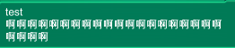
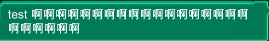
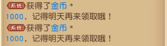

## UGUI Text自动换行问题  
有时候使用Text组建时会以空格作为标识自动换行，这个在英文中当然是合适的，但是放到中文中就会显得很奇怪。如  
  
理想结果为  
  
类似的  
  
解决可以参考：[解决方案](https://www.cnblogs.com/leoin2012/p/7162099.html)  
最佳方案则是将空格替换成[不换行空格(Non-breaking Space)](https://zh.wikipedia.org/wiki/%E4%B8%8D%E6%8D%A2%E8%A1%8C%E7%A9%BA%E6%A0%BC)。  
网上代码为：  

	using UnityEngine.UI;
	using UnityEngine;
	[RequireComponent(typeof(Text))]
	public class NonBreakingSpaceTextComponent : MonoBehaviour
	{
	    public static readonly string no_breaking_space = "\u00A0";
	    protected Text text;
	    // Use this for initialization
	    void Awake ()
	    {
	        text = this.GetComponent<Text>();
	        text.RegisterDirtyVerticesCallback(OnTextChange);
	    }
	
	    public void OnTextChange()
	    {
	        if (text.text.Contains(" "))
	        {
	            text.text = text.text.Replace(" ", no_breaking_space);
	        }
	    }
	}

但是考虑到多语言本地化的问题，可以加个语言的判定：  
栗子：  

    private const string no_breaking_space = "\u00A0";
    /// 

    /// Text组件换行，语言为中文时 空格不换行
    /// 

    /// <param name="text"></param>
    /// <returns></returns>
    public static string SolveLine(string text)
    {
        if (_LangManager.GetCurrentLang() == "zh_cn")
        {
            text = text.Replace(" ", no_breaking_space);
        }
        return text;
    }