## UGUI RectTransform  
本示例中中的RectTransform都是白块块的。  
[参考](https://www.jianshu.com/p/dbefa746e50d)
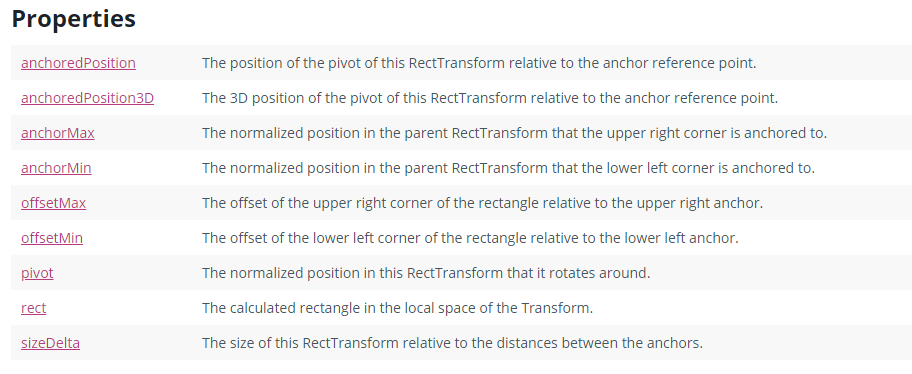  
RectTransform继承自Transform组建，增加了上述等特性。  
#### 1.Pivot
>1.理解为重心，对于旋转的时候会围绕设置的Pivot位置。
可以看到这里设置的为(1,1)即右上角
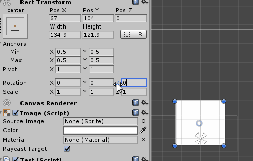  
 
>2. anchorPosition也是由Pivot距离Anchors锚点的位置得到。(存疑)  
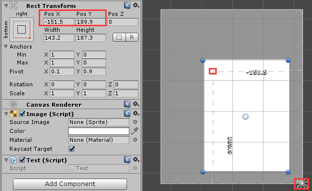

>3.如上图重心为(0.1,0.9)，可理解为  
> Pivot与左边距离/下边边长 = 0.1   
> Pivot与下边距离/左边边长 = 0.9  
> Pivot不变时，这个比例不会变，这时无论是在代码或是在hierarchy里调节边长和高，因为position，锚点和Pivot不变，所以结果必然如下图的按比例拓展：  
> 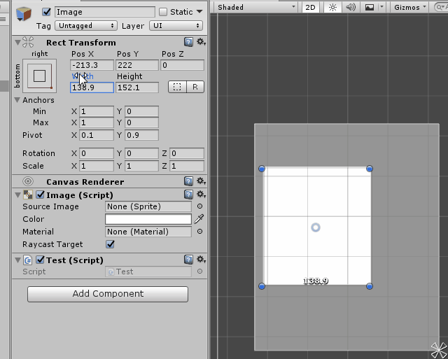  
> 所以将Pivot的x或y设置为0时可以实现单向长度变化。当然也可以设置为负数  

#### 2.Anchor  
对于锚点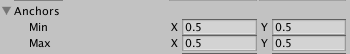的理解要参照于父物体。如下图  
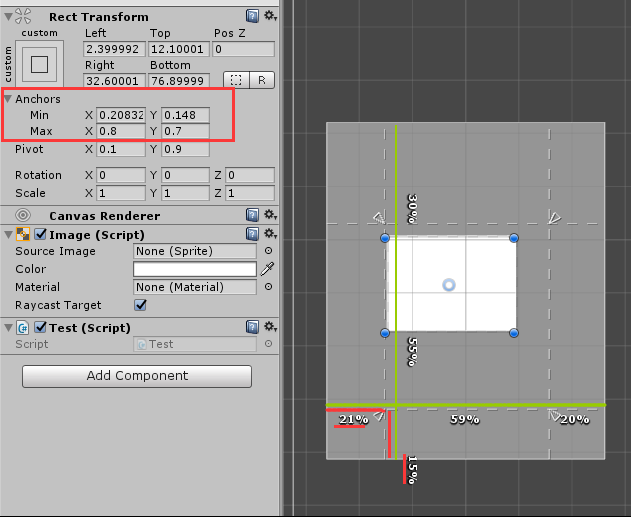  
此时设置的锚点是白块块的，但是其中的值是参考其父物体(灰块块的)，  

>0.208的含义是图中横向红线占绿线的比例  
0.148的含义是图中纵向红线占绿线的比例  
这样就定下了左下角锚框点**min**的位置。(即左线和下线)  
同理**max**为右上角锚框点的位置。(即右线和上线)  
**①而且！这个比例在父物体大小改变时不会改变**  
在锚点全部分开时，可以注意到RectTransform的坐标表示变了。如图：  
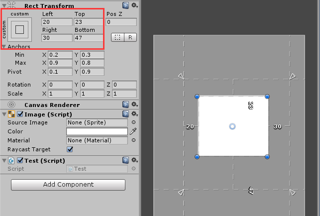  
**②通过上图右侧可以清晰看到left，top，right，bottom为距离各边的距离。**  
假如锚点有两个合并时，表现也会更换，如  
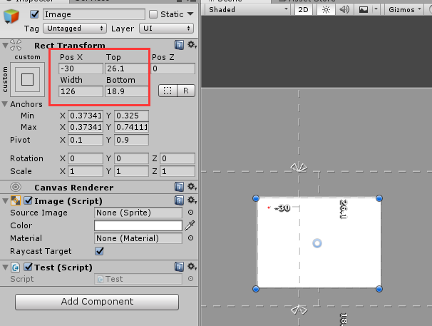  
这时父物体大小的变化不会影响其重心Pivot到锚点x的距离(PosX固定)此时Left= Pos X=，也不会影响其宽度变化(width固定)，所以就用这种方式表现了。  
结合上述①②两点，当父物体大小变化时的结果就是如下图所示：  
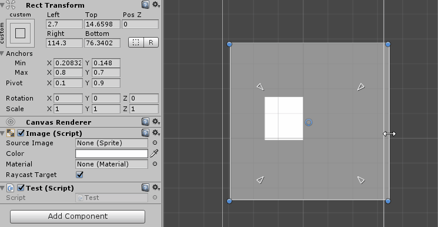  
注意，白块的左下角和白块的左下锚框相对位置不变，右上角同样，然后锚框比例在父物体大小改变时不会改变，这就导致了如图的结果。  

#### 3.RectTransform.localPosition  
RectTransform.localPosition是相对于父物体重心的偏移位置，如果父物体是RectTransform，参考点就是父物体pivot的位置，如果父物体是Transform，参考点就是position。如图：  
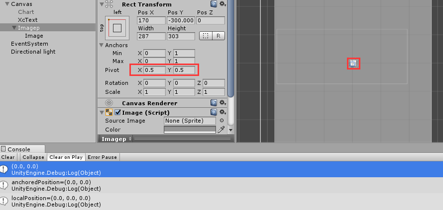  
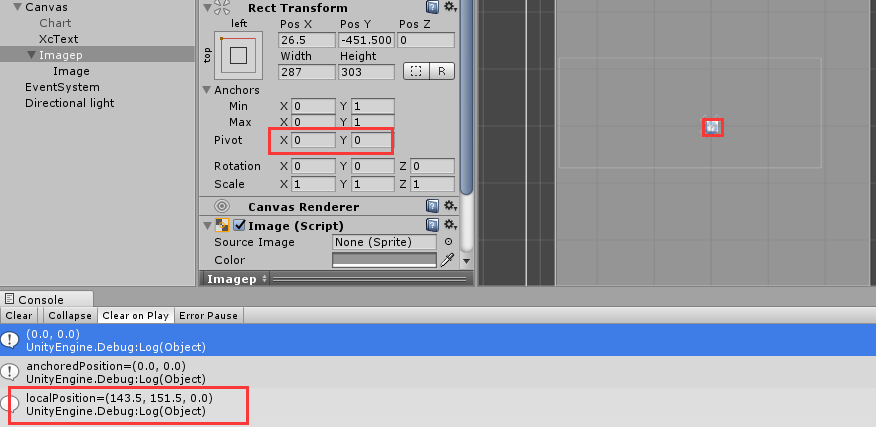  
调整父物体pivot位置，小白块位置不变但是localposition变化(位置正好是大灰块宽度长度的一半)  
#### 4.RectTransform.offsetMin  RectTransform.offsetMax 
如图：  
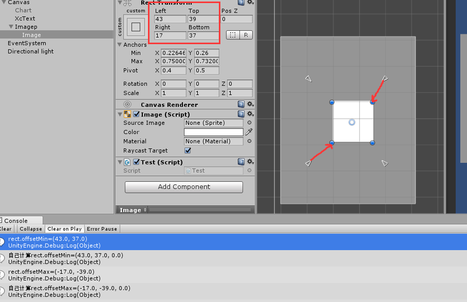  
RectTransform.offsetMin是图片左下角相对于该物体锚框左下角的相对位置。(即图中左下红线代表的向量)  
RectTransform.offsetMax是图片右上角相对于该物体锚框右上角的相对位置。(即图中右上红线代表的向量)  
上面我们在说Anchor的时候说过left，top，right，bottom的含义，这四个数值恰好对应于这两个坐标(offsetMin,offsetMax)  
为了验证上述的准确性，我们通过自己计算这个相对位移来验证。  

	//注意父物体的pivot要设为0,0 因为计算leftlow和upright时是假设父物体重心在左下，这样计算imgleftlow时用的rect.localPosition也是参考父物体的重心(左下)得来，从而统一
	rect = GetComponent<RectTransform>();
	parent = transform.parent.GetComponent<RectTransform>();
	//通过白块的锚点(位置占父rect比例)与灰块的长宽计算锚框左下角点相对于灰块左下角点的偏移位置
    Vector3 leftlow = new Vector2(parent.rect.width * rect.anchorMin.x,parent.rect.height * rect.anchorMin.y);
    Vector3 upright = new Vector2(parent.rect.width * rect.anchorMax.x,parent.rect.height * rect.anchorMax.y);
	//通过白块的localPosition(白块重心对于灰块重心的偏移)和白块pivot(重心)的位置得到白块左下角点的位置(相对于灰块重心)
	Vector3 imgleftlow = new Vector3(rect.localPosition.x - rect.pivot.x * rect.rect.width,rect.localPosition.y-rect.pivot.y*rect.rect.height,0);
    Vector3 imgupright = new Vector3(rect.localPosition.x + (1-rect.pivot.x) * rect.rect.width, rect.localPosition.y + (1-rect.pivot.y) * rect.rect.height, 0);

    Debug.Log("rect.offsetMin=" + rect.offsetMin);
	//两者相减算出偏移
    Debug.Log("自己计算rect.offsetMin=" +(imgleftlow-leftlow));
    Debug.Log("rect.offsetMax=" + rect.offsetMax);
    Debug.Log("自己计算rect.offsetMax=" + (imgupright-upright));

从上图可知，两者相同。所以offsetMin与锚点位置有关。锚点重合是同理。  
#### 5.RectTransform.sizeDelta 
RectTransform.sizeDelta就是offsetMax - offsetMin的值

    Debug.Log("sizeDelta为:" + rect.sizeDelta);
    Debug.Log("sizeDelta为:" + (rect.offsetMax - rect.offsetMin));  
#### 6.(rect.offsetMax + rect.offsetMin) / 2
这个得到的是锚框中心点距离图片中心的距离。  
证明如下：  
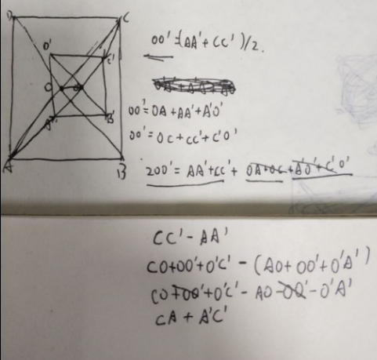  
当pivot设置为0.5,0.5时这个值和RectTransform.anchoredPosition是相等的。  
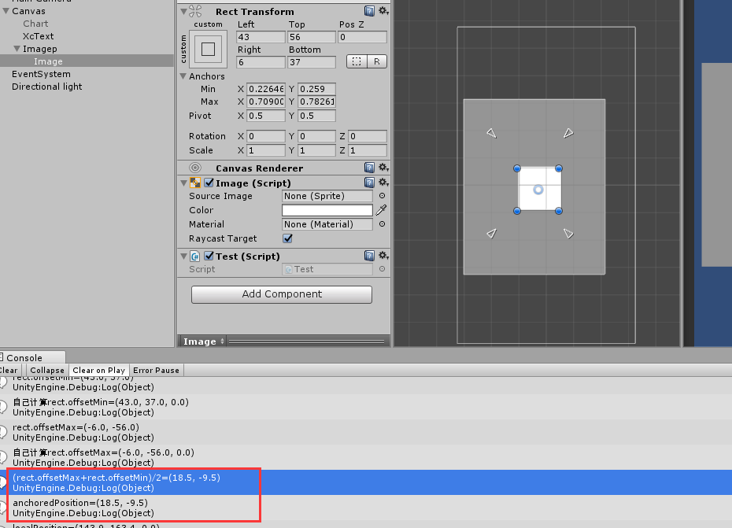  
#### 7.rect.anchoredPosition  
接上，所以anchoredPosition与锚框和pivot有关，计算公式见下面代码：  

    Vector2 diff = (rect.offsetMax + rect.offsetMin)/2;
    float disx =Convert.ToSingle(rect.sizeDelta.x*(0.5 - rect.pivot.x));
    float disy =Convert.ToSingle(rect.sizeDelta.y*(0.5 - rect.pivot.y));
    Debug.Log("anchoredPosition=" + rect.anchoredPosition);
    Debug.Log("自己计算anchoredPosition" + (diff.x - disx) + "," + (diff.y - disy));  
结果如图：  
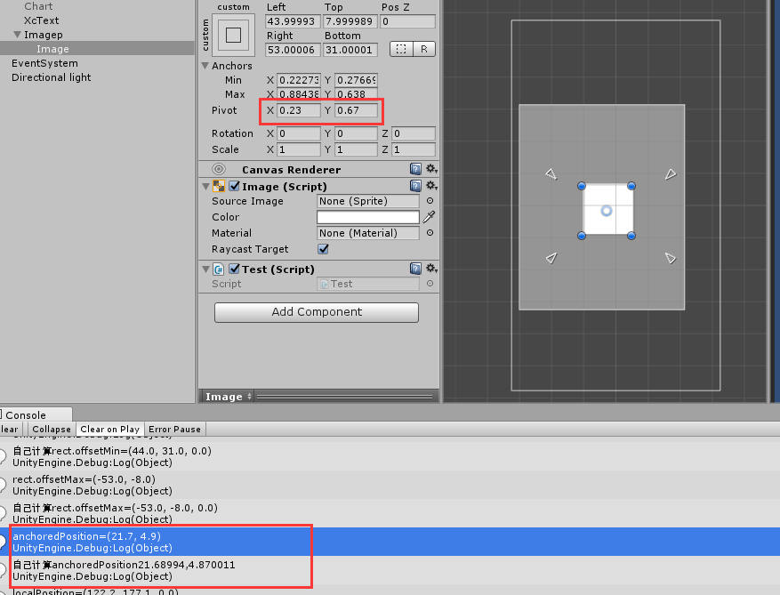  
通俗来讲，anchoredPosition就是锚框中心点距离图片中心的距离相应的再根据sizeDelta进行有关重心计算后再偏移(计算比较复杂)。  
代码见cs文件夹