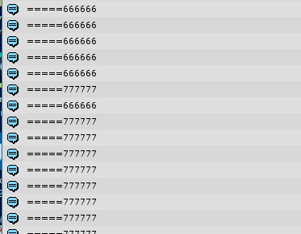

## Jedi listview的实现  
##设置：

	ListView _listView = ListView.Create<ChatMeItem>(null, _contentRect, _myMsg.gameObject);  
	_listView.AddItemModel<ChatOtherItem>(_otherMsg.gameObject);
	_listView.AddItemModel<ChatSysItem>(_sysMsg.gameObject);
**Create**方法：  

1. ListView list = new ListView();  
2. model = list.Content.GetChild(0).gameObject;//model预设体
3. list.AddItemModel\<T\>(model)

**AddItemModel**方法：  
1. Dictionary<string, GameObject> _listItemModels 添加model，key为typeof(T).FullName. T->ChatOtherItem/ChatSysItem

##调用：  

    switch (itemModelType)
    {
        case 1:
            _listView.AddItem<ChatSysItem>().RefreshAsSys(data);
            break;
        case 0:
            _listView.AddItem<ChatMeItem>().Refresh(data);
            break;
        case -1:
            _listView.AddItem<ChatOtherItem>().Refresh(data);
            break;
        default:
            break;
    }

**AddItem**方法：  

    //插入新的item，排在列表最后面
    public T AddItem<T>() where T : ListItem
    {
        var item = GetOrCreateItem<T>();
        item.transform.SetAsLastSibling(); //总是插在最后面
        _listItems.Add(item);
        return item;
    }
1. SetAsLastSibling 是让添加的model Gameobject放到最后。
2. 所有item(ChatMeItem/ChatOtherItem/ChatSysItem)继承**abstract ListItem**,_listItems是所有显示项的list。add此项item。

**GetOrCreateItem**方法：  

	private T GetOrCreateItem<T>() where T : ListItem
	{
	    ListItem ret = null;
	    string itemModelType = typeof(T).FullName;
	
	    var freeList = GetFreeList(itemModelType);
	    var itemModel = GetItemModel(itemModelType);
	
	
	    //先到缓存池中找
	    int count = freeList.Count;
	    if (count > 0)
	    {
	        ret = freeList[count - 1];
	        freeList.RemoveAt(count - 1);
	    }
	
	    //没找到则创建新的
	    if (ret == null)
	    {
	        ret = CreateItem<T>(itemModel, itemModelType);
	        ret.OnCreate();
	    }
	
	    ret.transform.localScale = Vector3.one;
	    ret.gameObject.SetActive(true);
	
	    return (T) ret;
	}
freeList：  

* 一个dic，  
* key为item type(ChatMeItem/ChatOtherItem/ChatSysItem)的string。  
* value为List\<ListItem\>的一个list。//此举是为了不造成GC，即缓存池

GetFreeList：  

* 用类型的name作为key找到已经缓存对应的List\<ListItem\>实例list。  
* 代码中 //先到缓存池中找，则执行了一个取出一个**实例**的步骤。

GetItemModel:  
 
* 从_listItemModels里拿出一个Gameobject。  
* model肯定能找到，因为之前添加了。

CreateItem：  

* //缓存池free中没找到对应类型实例则创建新的
>
    private T CreateItem<T>(GameObject itemModel, string itemModelType) where T : ListItem
    {
        var t = Object.Instantiate(itemModel).transform;
        t.SetParent(Content, false);
        var ret = (ListItem)Activator.CreateInstance(typeof(T));
        ret.gameObject = t.gameObject;
        ret.List = this;
        ret.ItemModelType = itemModelType;
        return (T)ret;
    }
* 新建了个Gameobject，
* 新建了个对应的listitem(ChatMeItem/ChatOtherItem/ChatSysItem)类
* Gameobject和listitem建立联系ret.gameObject = t.gameObject;。
* listitem持有Listview实例
* 至此可以知道每一个listitem实例持有一个对应的Gameobject。

##移除
	_listView.RemoveItemAt(0);
**RemoveItemAt**：  

    public void RemoveItemAt(int index)
    {
        var item = _listItems[index];
        var freeList = GetFreeList(item.ItemModelType);
        _listItems.RemoveAt(index);
        freeList.Add(item);
        item.SetVisible(false);
    }
* 显示的列表项_listItems移除对应index。  
* 得到对应以listitem为key的list池子。添加进item。
* 设置不可见，界面上移除

----
以上就是上述缓存步骤。但是仍有一个疑问，就是实例化的类并未摧毁，那对于复用上一个实例时，之前缓存值会不会有影响呢。  
为了验证我们在listitem里放入  

    private int test = 666666;
    public void Refresh(P_Chat data)
    {
        Debug.Log("=====" + test);
        test = 777777;
	}
这样一段代码进行测试。  
最后结果：  
  
果然只有初始化的时候是用的默认值。后来的使用都是用了上次的缓存值777777。  
所以：  
##### Refresh 里需要刷新所有值。以此避免缓存值的影响。