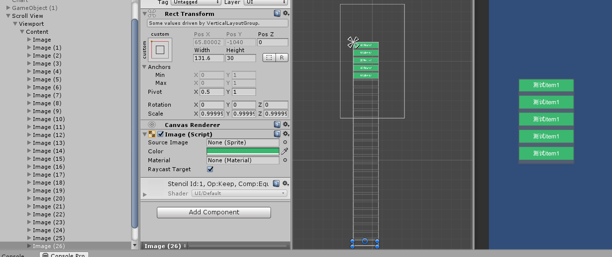
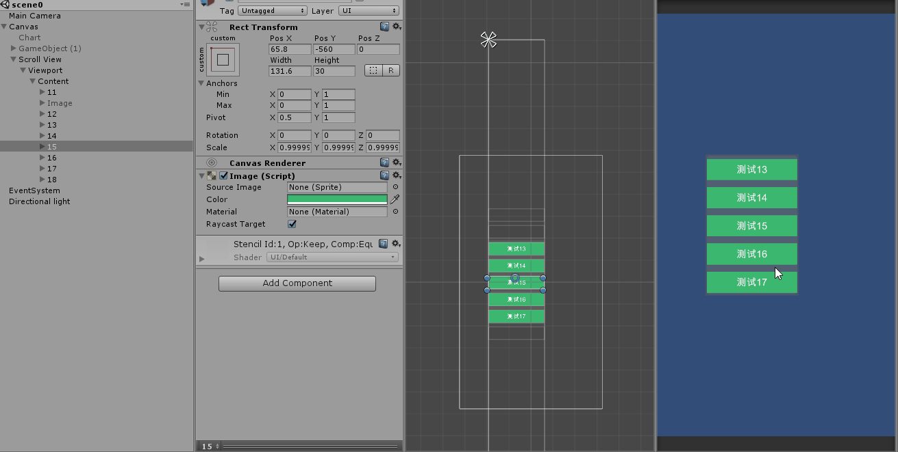

## UGUI listItem复用  
如图：  
  
为了避免如图情况(viewport仅显示少量item，但是新建了大量的pfbItem)导致的滑动卡顿和内存问题。  
可以仅做viewport里显示的item进行刷新和新建obj。  
效果：  
  
可以看到，仅viewport内的item有被刷新(信息/位置)  
对应脚本在cs文件夹里。  

如果每一个item都需要加载一个不同的pfb，利用上述思想实现分段加载GameObject，对应cs文件在cs/分段LoadGo里。  
使用栗子：   

	ListReuse2 _list = ListReuse2.Create(scrollView, _height, GetPfbNameByIndex, UpdateInfo, GetModelByName);


核心方法1：GetCellIndexAtPosition(float pos)

根据pos获取该位置的index。

那么问题出现了，落在格子上还好，落在间隙上算谁的呢。暂定算下一个格子

使用例子

```
private ListReuse3<Item> _list;
_list = ListReuse3<Item>.Create(transform,RefreshIndex,ScrollDirectionEnum.Horizontal);
_list.Refresh(data.Count);
```

