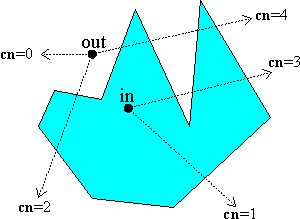

## 点在面内  
点在多边形内常用的算法就是使用射线法，  
  
任一射线穿过多边形，奇数段位于多边形之内，偶数段位于多边形之外。  
如有多边形 Vector2[] polyPoints,点Vector2 p。
这里我们假设以**该点水平向右的射线**为检测射线。  
则：  
需判断该条水平射线与某个线段a(x1,y1),b(x2,y2)相交.  
若相交则，交点c(x,y)  

* x>=p.x (因为是水平向右射线) 
* (y1<=y&&y<=y2)||(y2<=y&&y<=y1) (y值在两条线段中)
* y=p.y (因为是水平向右射线) 

		由斜率相等的 Kca = Kcb  
		即 (c.x-x1)/(x1-x2) = (c.y-y1)/(y1-y2)  
		c.x = (c.y-y1)/(y1-y2)*(x1-x2)+x1  
		又c.y = p.y  
		所以满足((y1<=p.y&&p.y<=y2)||(y2<=p.y&&p.y<=y1))&&(p.y-y1)/(y1-y2)*(x1-x2)+x1 >= p.x  
		的点P与线段ab相交  

		//与多边形相交代码
	    bool ContainsPoint(Vector2[] polyPoints, Vector2 p)
	    {
	        int j = polyPoints.Length - 1;
	        bool inside = false;
	
	        for (int i = 0; i < polyPoints.Length; i++)
	        {
	            if (((polyPoints[i].y < p.y && p.y <= polyPoints[j].y) || (polyPoints[j].y < p.y && p.y <= polyPoints[i].y)) &&
	            (polyPoints[i].x + (p.y - polyPoints[i].y) / (polyPoints[j].y - polyPoints[i].y) * (polyPoints[j].x - polyPoints[i].x)) > p.x)
	                inside = !inside;
	            j = i;
	        }
	        return inside;
	    }