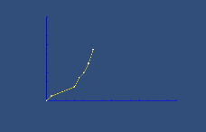

                List<Vector2> v2List = new List<Vector2>(4)
            {
                new Vector2(0000,0),
                new Vector2(1000,1),
                new Vector2(6000,3),
                new Vector2(7000,5),
                new Vector2(8000,6),
                new Vector2(9000,8),
                new Vector2(10000,11),
            };
                Chart.Plot(v2List, 100, 0.1f);  
如图：

代码在cs/Chart

