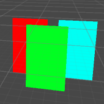

类似3d卡片的选择。



输入:需要考虑(左右滑动，加速度，停下时的阻尼，是否要让某个卡片停到中央)

输出:卡片位置的函数

另外还需要调整UGUI在Hierarchy的层级顺序

代码如下： 

鼠标输入：

```
public class PointerEvent : MonoBehaviour
{
    // The offset from handle position to mouse down position
    private Vector2 m_PointerStartLocalCursor = Vector2.zero;
    protected float m_ContentStartAngle = 0;
    private RectTransform m_ViewRect;
    private bool m_Dragging;
    private float m_Velocity;
    private float m_Elasticity = 0.1f; // Only used for MovementType.Elastic
    private float m_DecelerationRate = 0.03f; // Only used when inertia is enabled

    private float angle = 60;
    private float preAngle;
    private bool _toAim;
    private float _aimAngle;
    public override void Awake()
    {
        base.Awake();

        EventTrigger trigger = gameObject.GetComponent<EventTrigger>();
        if (trigger == null)
        {
            trigger = gameObject.AddComponent<EventTrigger>();
        }

        EventTrigger.Entry entry = new EventTrigger.Entry { eventID = EventTriggerType.Drag };
        entry.callback.AddListener(data => { OnDrag((PointerEventData)data); });
        trigger.triggers.Add(entry);

        entry = new EventTrigger.Entry { eventID = EventTriggerType.BeginDrag };
        entry.callback.AddListener(data => { OnBeginDrag((PointerEventData)data); });
        trigger.triggers.Add(entry);

        entry = new EventTrigger.Entry { eventID = EventTriggerType.EndDrag };
        entry.callback.AddListener(data => { OnEndDrag((PointerEventData)data); });
        trigger.triggers.Add(entry);
    }
    protected RectTransform viewRect
    {
        get
        {
            if (m_ViewRect == null)
                m_ViewRect = (RectTransform)transform;
            return m_ViewRect;
        }
    }
    private void OnEndDrag(PointerEventData eventData)
    {
        m_Dragging = false;
        if (Math.Abs(m_Velocity) < 0.01)
        {
            _toAim = true;
            _aimAngle = NearstAngle(angle);
        }
    }

    private void OnBeginDrag(PointerEventData eventData)
    {
        if (eventData.button != PointerEventData.InputButton.Left)
            return;

        Game.Instance.AudioManager.PlaySound(AudioType.AS_Operation, SoundType.ID_2202);

        _toAim = false;
        m_PointerStartLocalCursor = Vector2.zero;
        RectTransformUtility.ScreenPointToLocalPointInRectangle(viewRect, eventData.position, eventData.pressEventCamera, out m_PointerStartLocalCursor);
        m_ContentStartAngle = angle;
        m_Dragging = true;
    }

    private void OnDrag(PointerEventData eventData)
    {
        if (eventData.button != PointerEventData.InputButton.Left)
            return;


        Vector2 localCursor;
        if (!RectTransformUtility.ScreenPointToLocalPointInRectangle(viewRect, eventData.position, eventData.pressEventCamera, out localCursor))
            return;


        var pointerDelta =(m_PointerStartLocalCursor - localCursor)/2;
        angle = m_ContentStartAngle + pointerDelta.x;

    }
    public float UpdateAngle()
    {
        float deltaTime = Time.unscaledDeltaTime;
        if (!m_Dragging)
        {

            if (Math.Abs(m_Velocity) > 0.01)
            {
                m_Velocity *= Mathf.Pow(m_DecelerationRate, deltaTime);
                if (Mathf.Abs(m_Velocity) < 30)
                {
                    m_Velocity = 0;
                    _toAim = true;
                    _aimAngle = NearstAngle(angle);
                }
                angle += m_Velocity*deltaTime;
            }
            else
            {
                if (_toAim && Math.Abs(angle - _aimAngle) > 0.01)
                {
                    angle = Mathf.Lerp(angle, _aimAngle, m_Elasticity);
                }
            }

        }
        if (m_Dragging)
        {
            float newVelocity = (angle - preAngle) / deltaTime;
            m_Velocity = Mathf.Lerp(m_Velocity, newVelocity, deltaTime * 10);
        }
        preAngle = angle;
        return angle;
    }


    private float NearstAngle(float angle1)
    {
        int nearstNum = Mathf.RoundToInt((angle1 - 60)/120);
        return nearstNum * 120 + 60;

    }

    public void Next()
    {
        _toAim = true;
        var next = angle + 120;
        _aimAngle = NearstAngle(next);
    }

    public void Pre()
    {
        _toAim = true;
        var next = angle - 120;
        _aimAngle = NearstAngle(next);
    }
}
```

位置输出：

```
public class ElementLayOut : MonoBehaviour
{
    private Transform[] _child;
    private float _angle;
    private Vector3 _center = new Vector3(0, 0, 300);

    public override void Awake()
    {
        base.Awake();
        _child = new Transform[transform.childCount];
        for (int i = 0; i < transform.childCount; i++)
        {
            _child[i] = transform.GetChild(i);
        }

    }


    public void Updata(float angle)
    {
        SetOrderAndPosByInput(angle);
    }
    public void SetOrderAndPosByInput(float angle)
    {
        for (int i = 0; i < _child.Length; i++)
        {
            _child[i].localPosition = CalculateByInput(angle, i);
        }
        SortOrder();
    }
    public void SortOrder()
    {
        int n = 0;
        int count = transform.childCount;
        for (int i = 0; i < count; i++)
        {
            Transform maxZ = transform.GetChild(0);
            for (int j = 0; j < count - n; j++)
            {
                var t = transform.GetChild(j);
                if (t.localPosition.z > maxZ.localPosition.z)
                    maxZ = t;
            }
            maxZ.SetAsLastSibling();
            n++;
        }
    }
    //根据公式计算输出
    public Vector3 CalculateByInput(float angle, int index)
    {
        var radius = 200;
        float hudu = (90 - angle + index * 120) / 180f * Mathf.PI;
        var x = _center.x + radius * Mathf.Cos(hudu);
        var z = _center.z + radius * Mathf.Sin(hudu);
        return new Vector3(x, 0, z);
    }
}
```

主循环：

```
    public void Update()
    {
        var angle = _event.UpdateAngle();
        _layout.Updata(angle);
    }
```

