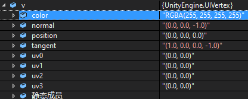
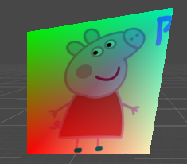

#####  VertexHelper

原文链接： https://www.jianshu.com/p/2245969a9173 

> UGUI提供了我们自己构建顶点、三角形的类，那就是`VertexHelper`类。 通过这个类，我们可以创建顶点，构成三角形，填充到一张mesh上，然后用`MeshRenderer`渲染到屏幕上，实际上我们可以直接操作Mesh类添加顶点、三角形等操作，这里的`vertexHelper`只是UGUI与Mesh之间的一座桥梁。
>
> 
>
> `VertexHelper `是用来存储生成 Mesh 网格需要的所有数据，在Mesh生成的过程中使用频率非常高，不过 `VertexHelper` 只负责存储 Mesh 相关数据，不负责计算和生成 Mesh。 


**UIVertex.simpleVert**：将UIVertex设为一个明智的值




VertexHelper里有很多list变量如：

```C#
        private List<Vector3> m_Positions = ListPool<Vector3>.Get();
        private List<Color32> m_Colors = ListPool<Color32>.Get();
        private List<Vector2> m_Uv0S = ListPool<Vector2>.Get();
        private List<Vector2> m_Uv1S = ListPool<Vector2>.Get();
        private List<Vector2> m_Uv2S = ListPool<Vector2>.Get();
        private List<Vector2> m_Uv3S = ListPool<Vector2>.Get();
        private List<Vector3> m_Normals = ListPool<Vector3>.Get();
        private List<Vector4> m_Tangents = ListPool<Vector4>.Get();
        private List<int> m_Indices = ListPool<int>.Get();
```

**AddVert**方法可以将**一个**顶点的所有数据添加进去：(这个相当于添加原始数据)

```C#
public void AddVert(Vector3 position, Color32 color, Vector2 uv0, Vector2 uv1, Vector3 normal, Vector4 tangent)
{
    m_Positions.Add(position);
    m_Colors.Add(color);
    m_Uv0S.Add(uv0);
    m_Uv1S.Add(uv1);
    m_Uv2S.Add(Vector2.zero);
    m_Uv3S.Add(Vector2.zero);
    m_Normals.Add(normal);
    m_Tangents.Add(tangent);
}

public void AddVert(UIVertex v)//仅传参方式不同
{
    AddVert(v.position, v.color, v.uv0, v.uv1, v.normal, v.tangent);
}
```

**AddTriangle**会将顶点索引添加进`m_Indices`,三个一组正好一个三角形：(这个是利用原始数据构造三角形)

```C#
public void AddTriangle(int idx0, int idx1, int idx2)
{
    m_Indices.Add(idx0);
    m_Indices.Add(idx1);
    m_Indices.Add(idx2);
}
```

**AddUIVertexQuad**方法参数是一次四个顶点，调用AddVert添加原始数据的同时构建三角形：

```C#
public void AddUIVertexQuad(UIVertex[] verts)
{
    int startIndex = currentVertCount;

    for (int i = 0; i < 4; i++)
        AddVert(verts[i].position, verts[i].color, verts[i].uv0, verts[i].uv1, verts[i].normal, verts[i].tangent);

    AddTriangle(startIndex, startIndex + 1, startIndex + 2);
    AddTriangle(startIndex + 2, startIndex + 3, startIndex);
}

//顶点顺序为
1———2
|	|
0———3
```

因为`vertexHelper`只是UGUI与Mesh之间的一座桥梁。最后还是需要通过**mesh**画出来：

```C#
public void FillMesh(Mesh mesh)
{
    mesh.Clear();

    if (m_Positions.Count >= 65000)
        throw new ArgumentException("Mesh can not have more than 65000 vertices");

    mesh.SetVertices(m_Positions);
    mesh.SetColors(m_Colors);
    mesh.SetUVs(0, m_Uv0S);
    mesh.SetUVs(1, m_Uv1S);
    mesh.SetUVs(2, m_Uv2S);
    mesh.SetUVs(3, m_Uv3S);
    mesh.SetNormals(m_Normals);
    mesh.SetTangents(m_Tangents);
    mesh.SetTriangles(m_Indices, 0);
    mesh.RecalculateBounds();
}
```

* 经测试这里的**m_Positions**的大小是以当前transform坐标为圆心的local坐标。**受transform缩放和位置影响(即最终位置会*缩放)**，因为transform缩放和位置会影响模型空间到裁剪空间的矩阵。

* 对于**m_Colors**当通过`mesh.SetColors(m_Colors)`设置好顶点颜色后，最后的展示还是需要shader对顶点颜色进行相应处理。

  因为UGUI的内置 shader，UI/Default  UI-Default有对应的处理部分，所以才能做一些文字颜色渐变的效果。

  一个像素点的最终输出颜色是由shader自行决定的，可以参考的点包括

   	1. 模型顶点的颜色
   	2. 有贴图时，参考贴图的取样颜色`Properties {_MainTex("Main Tex",2D) = "white"{}}`
   	3. shader内部定义类似`Properties {_Color ("Color Tint",Color) = (1,1,1,1)}`，暴露给材质球，用以使用者自己调节
   	4. 再根据光照计算等
   	5. 其他
  
  这里举一个将_MainTex的图片与顶点色叠加展示的shader例子。
  
  ```
  v2f vert(a2v v){
  	v2f o;
  	o.pos = UnityObjectToClipPos(v.vertex);//模型空间到裁剪空间
  	//v.texcoord 对应 UIVertex->uv0
  	o.uv.xy = v.texcoord.xy * _MainTex_ST.xy + _MainTex_ST.zw;
  	o.color = v.color;//拿到顶点色 这里的顶点色就是下面OnPopulateMesh设置的颜色
  	return o;
}
  fixed4 frag(v2f i) : SV_Target{
	//取纹理色
  	fixed3 albedo = tex2D(_MainTex,i.uv).rgb;
	fixed3 ambient = albedo * i.color.rgb;//纹理色和顶点色叠加
  	return fixed4(ambient,1);
}
  ```

  彩色佩奇：
  
  
  
  这里重写了UGUI里OnPopulateMesh方法：
  
  核心代码：
  
  ```c#
  protected override void OnPopulateMesh(VertexHelper vh)
  {
      // prepare vertices
      vh.Clear();
      if (!gameObject.activeInHierarchy)
      {
          return;
      }
      //注意这里，UGUI会采样s_WhiteTexture
      s_WhiteTexture = (Texture2D)material.mainTexture;
  
      UIVertex v = UIVertex.simpleVert;
      v.position = new Vector3(0,0,0);
      v.color = new Color(1,0,0,0.5f);
      v.uv0 = new Vector2(0, 0);
      _quad[0] = v;
      v = UIVertex.simpleVert;
      v.position = new Vector3(0, 50, 0);
      v.color = new Color(0, 1, 0,0.5f);
      v.uv0 = new Vector2(0,1);
      _quad[1] = v;
      v = UIVertex.simpleVert;
      v.position = new Vector3(60, 60, 0);
      v.color = new Color(0, 1, 1, 0.5f);
      v.uv0 = new Vector2(1, 1);
      _quad[2] = v;
      v = UIVertex.simpleVert;
    v.position = new Vector3(50, 0, 0);
      v.color = new Color(1, 1, 1, 0.5f);
      v.uv0 = new Vector2(1, 0);//通过设置取样点可以展示图片的一部分
      _quad[3] = v;
      
      vh.AddUIVertexQuad(_quad);
  }
  ```
  
  代码在cs/OnPopulateMesh设置顶点色

