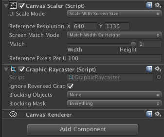

## UGUI的屏幕坐标转换
  
在选择了Screen Match Mode为Match Height时，要把重写了方法的  

	public void  OnPointerDown (PointerEventData eventData)
	{
	}
**eventData**进行坐标转换，转换为UGUI Canvas画布上的对应坐标。  
**Match Height**时，以**高度1136像素**为例转换公式为  

    private Vector3 TransformToRelativePos (Vector3 originPos)
    {
        Vector3 transform = Vector3.zero;
        transform.x = (1136f / Screen.height) * (originPos.x - (Screen.width / 2f));
        transform.y = 1136f * (originPos.y / Screen.height - 0.5f);
        return transform;
    }

以**宽度750像素**为例转换公式为  

    /// 

    /// 将鼠标点下去的坐标转换成相对坐标。PS:这里是matchwithwidth
    /// 

    /// <returns>The to relative position.</returns>
    /// <param name="originPos">Origin position.</param>
    private Vector3 TransformToRelativePos(Vector3 originPos)
    {
        Vector3 transform = Vector3.zero;
        transform.x = (750f / Screen.width) * (originPos.x - (Screen.width / 2f));
        transform.y = Screen.height * (originPos.y / Screen.height - 0.5f);
        return transform;
    }

**附带世界坐标转屏幕坐标**

	Vector3 transPos = transCamera.WorldToScreenPoint(itemPos);
	transPos = TransformToRelativePos(transPos);  
	private Vector3 TransformToRelativePos(Vector3 originPos)
	{
	    RectTransformUtility.ScreenPointToLocalPointInRectangle(_root as RectTransform,originPos, canvas.worldCamera, out _pos);
	    return _pos;
	}

最后：上述的两个坐标转换应对其他情况多多少少都会有一些偏差。所以还是用unity自带的api比较保险。  

**WorldToScreenPoint**：将世界坐标通过transCamera转换为屏幕坐标，左下是(0,0),右上是([pixelWidth](https://docs.unity3d.com/ScriptReference/Camera-pixelWidth.html),[pixelHeight](https://docs.unity3d.com/ScriptReference/Camera-pixelHeight.html))像素分辨率的最大值。$z$值不变。

**ScreenPointToLocalPointInRectangle**：将一个屏幕坐标originPos,通过相机转换到_root里的本地坐标。

代码见cs

