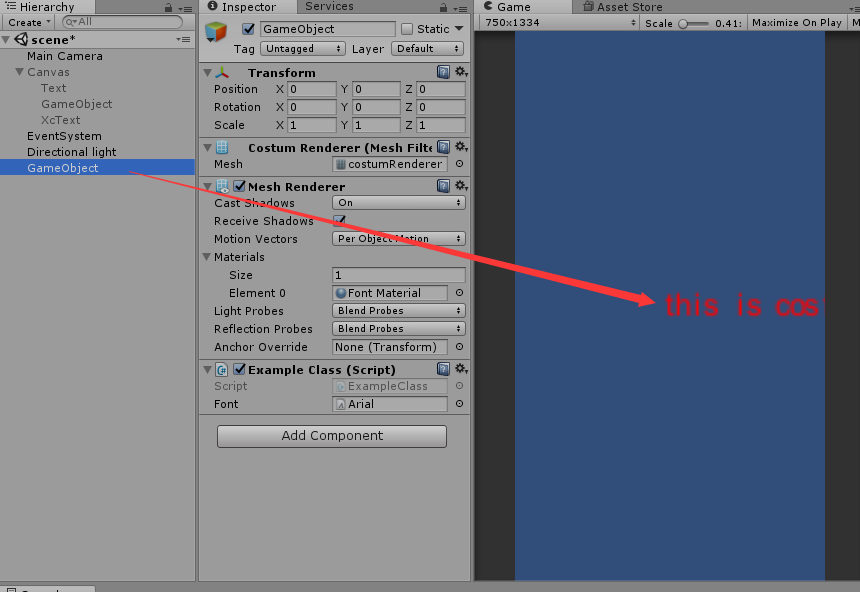
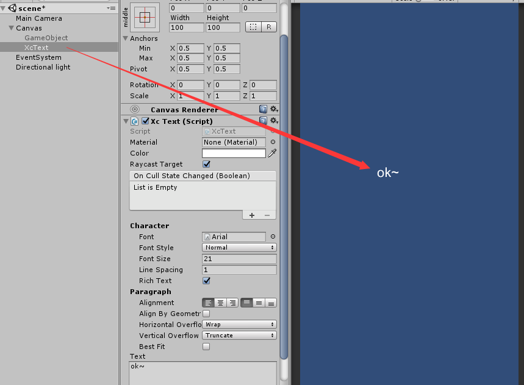
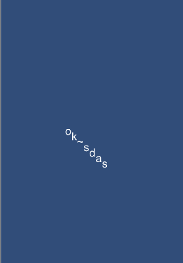

## UGUI自己实现text  
实现text有两种方式，第一个是用MeshRenderer渲染。第二个是用CanvasRenderer渲染。  
两者共同步骤是   

* 用TextGenerator生成文字(包含顶点信息)
* 用文字的顶点信息绘制mesh
* 设置渲染的**mesh**和**material**(从font中获取)

#### 1.接下来用MeshRenderer渲染文字，代码如下： 
注意：1.挂在Gameobject上并且保证被摄像机照到。2.字体Font要设置好

	using UnityEngine;
	using System.Collections.Generic;
	[RequireComponent(typeof(MeshFilter), typeof(MeshRenderer))]
	public class ExampleClass : MonoBehaviour
	{
	    public Font font;
	    void Start()
	    {
	        TextGenerationSettings settings = new TextGenerationSettings();
	        settings.textAnchor = TextAnchor.MiddleCenter;
	        settings.color = Color.red;
	        settings.generationExtents = new Vector2(500.0F, 200.0F);
	        settings.pivot = Vector2.zero;
	        settings.richText = true;
	        settings.font = font;
	        settings.fontSize = 18;
	        settings.fontStyle = FontStyle.Normal;
	        settings.verticalOverflow = VerticalWrapMode.Overflow;
	        TextGenerator generator = new TextGenerator();
	        generator.PopulateWithErrors("this is costum!", settings, gameObject);
	        Debug.Log("I generated: " + generator.vertexCount + " verts!");
	
	        Mesh mesh = new Mesh();
	        mesh.name = "costumRenderer";
	        MeshFilter mf = GetComponent<MeshFilter>();
	        MeshRenderer  mr = GetComponent<MeshRenderer>();
	        mf.mesh = mesh;
	        mr.sharedMaterial = font.material;
	        GetMesh(generator,mesh);
	    }
	
	
	    public void GetMesh(TextGenerator iGenerator, Mesh o_Mesh)
	    {
	        if (o_Mesh == null)
	            return;
	
	        int vertSize = iGenerator.vertexCount;
	        Vector3[] tempVerts = new Vector3[vertSize];
	        Color32[] tempColours = new Color32[vertSize];
	        Vector2[] tempUvs = new Vector2[vertSize];
	        IList<UIVertex> generatorVerts = iGenerator.verts;
	
	
	
	        for (int i = 0; i < vertSize; ++i)
	        {
	            tempVerts[i] = generatorVerts[i].position / 20f;
	            tempColours[i] = generatorVerts[i].color;
	            tempUvs[i] = generatorVerts[i].uv0;
	        }
	
	        for (int i = 0; i < tempVerts.Length; i++)
	        {
	            tempVerts[i].x += (i / 4) * 0.3f;//字间距
	        }
	        o_Mesh.vertices = tempVerts;
	        o_Mesh.colors32 = tempColours;
	        o_Mesh.uv = tempUvs;
	
	        int characterCount = vertSize / 4;
	        int[] tempIndices = new int[characterCount * 6];
	        for (int i = 0; i < characterCount; ++i)
	        {
	            int vertIndexStart = i * 4;
	            int trianglesIndexStart = i * 6;
	            tempIndices[trianglesIndexStart++] = vertIndexStart;
	            tempIndices[trianglesIndexStart++] = vertIndexStart + 1;
	            tempIndices[trianglesIndexStart++] = vertIndexStart + 2;
	            tempIndices[trianglesIndexStart++] = vertIndexStart;
	            tempIndices[trianglesIndexStart++] = vertIndexStart + 2;
	            tempIndices[trianglesIndexStart] = vertIndexStart + 3;
	        }
	        o_Mesh.triangles = tempIndices;
	        //TODO: setBounds manually
	        o_Mesh.RecalculateBounds();
	    }
	
	}
效果：  

#### 2.接下来用CanvasRenderer渲染文字，代码如下： 
注意：1.要挂在canvas下面

	using System.Collections.Generic;
	using UnityEngine;
	using UnityEngine.UI;
	
	public class XcText : MaskableGraphic
	{
	    [SerializeField]
	    private FontData m_FontData = FontData.defaultFontData;
	
	    readonly UIVertex[] m_TempVerts = new UIVertex[4];
	
	    [TextArea(3, 10)]
	    [SerializeField]
	    protected string m_Text = string.Empty;
	    public Font font
	    {
	        get
	        {
	            return m_FontData.font;
	        }
	        set
	        {
	            if (m_FontData.font == value)
	                return;
	            m_FontData.font = value;
	            SetAllDirty();
	        }
	    }
	
	    public virtual string text
	    {
	        get
	        {
	            return m_Text;
	        }
	        set
	        {
	            if (string.IsNullOrEmpty(value))
	            {
	                if (string.IsNullOrEmpty(m_Text))
	                    return;
	                m_Text = "";
	                SetVerticesDirty();
	            }
	            else if (m_Text != value)
	            {
	                m_Text = value;
	                SetVerticesDirty();
	                SetLayoutDirty();
	            }
	        }
	    }
	    protected override void OnPopulateMesh(VertexHelper toFill)
	    {
	        if (font == null)
	            return;
	
	        // We don't care if we the font Texture changes while we are doing our Update.
	        // The end result of cachedTextGenerator will be valid for this instance.
	        // Otherwise we can get issues like Case 619238.
	
	
	        Vector2 extents = rectTransform.rect.size;
	
	        var settings = GetGenerationSettings(extents);
	        TextGenerator generator = new TextGenerator();
	        generator.PopulateWithErrors(text, settings, gameObject);
	        // Apply the offset to the vertices
	        IList<UIVertex> verts = generator.verts;
	        float unitsPerPixel = 1 / pixelsPerUnit;
	        //Last 4 verts are always a new line... (\n)
	        int vertCount = verts.Count - 4;
	
	        Vector2 roundingOffset = new Vector2(verts[0].position.x, verts[0].position.y) * unitsPerPixel;
	        roundingOffset = PixelAdjustPoint(roundingOffset) - roundingOffset;
	        toFill.Clear();
	        if (roundingOffset != Vector2.zero)
	        {
	            for (int i = 0; i < vertCount; ++i)
	            {
	                int tempVertsIndex = i & 3;
	                m_TempVerts[tempVertsIndex] = verts[i];
	                m_TempVerts[tempVertsIndex].position *= unitsPerPixel;
	                m_TempVerts[tempVertsIndex].position.x += roundingOffset.x;
	                m_TempVerts[tempVertsIndex].position.y += roundingOffset.y;
	                if (tempVertsIndex == 3)
	                    toFill.AddUIVertexQuad(m_TempVerts);
	            }
	        }
	        else
	        {
	            for (int i = 0; i < vertCount; ++i)
	            {
	                int tempVertsIndex = i & 3;
	                m_TempVerts[tempVertsIndex] = verts[i];
	                m_TempVerts[tempVertsIndex].position *= unitsPerPixel;
					//m_TempVerts[tempVertsIndex].position += new Vector3(0, i/4 * -10, 0);//倾斜
	                if (tempVertsIndex == 3)
	                    toFill.AddUIVertexQuad(m_TempVerts);
	            }
	        }
	    }
	    public TextGenerationSettings GetGenerationSettings(Vector2 extents)
	    {
	        var settings = new TextGenerationSettings();
	
	        settings.generationExtents = extents;
	        if (font != null && font.dynamic)
	        {
	            settings.fontSize = m_FontData.fontSize;
	            settings.resizeTextMinSize = m_FontData.minSize;
	            settings.resizeTextMaxSize = m_FontData.maxSize;
	        }
	
	        // Other settings
	        settings.textAnchor = m_FontData.alignment;
	        settings.alignByGeometry = m_FontData.alignByGeometry;
	        settings.scaleFactor = pixelsPerUnit;
	        settings.color = color;
	        settings.font = font;
	        settings.pivot = rectTransform.pivot;
	        settings.richText = m_FontData.richText;
	        settings.lineSpacing = m_FontData.lineSpacing;
	        settings.fontStyle = m_FontData.fontStyle;
	        settings.resizeTextForBestFit = m_FontData.bestFit;
	        settings.updateBounds = false;
	        settings.horizontalOverflow = m_FontData.horizontalOverflow;
	        settings.verticalOverflow = m_FontData.verticalOverflow;
	
	        return settings;
	    }
	    public float pixelsPerUnit
	    {
	        get
	        {
	            var localCanvas = canvas;
	            if (!localCanvas)
	                return 1;
	            // For dynamic fonts, ensure we use one pixel per pixel on the screen.
	            if (!font || font.dynamic)
	                return localCanvas.scaleFactor;
	            // For non-dynamic fonts, calculate pixels per unit based on specified font size relative to font object's own font size.
	            if (m_FontData.fontSize <= 0 || font.fontSize <= 0)
	                return 1;
	            return font.fontSize / (float)m_FontData.fontSize;
	        }
	    }
	    public override Texture mainTexture
	    {
	        get
	        {
	            if (font != null && font.material != null && font.material.mainTexture != null)
	                return font.material.mainTexture;
	
	            if (m_Material != null)
	                return m_Material.mainTexture;
	
	            return base.mainTexture;
	        }
	    }
	}
效果：  
  
这里没有和用`MeshRenderer`一样设置材质和mesh的代码

	m_CanvasRenderer.SetMaterial(m_Font.material, null);
	m_CanvasRenderer.SetMesh(m_Mesh);
因为我们是继承的`MaskableGraphic`是UGUI的组件，设置材质和mesh的步骤由是ugui完成的。根据的是上述代码里的`font.material.mainTexture`(材质)和`OnPopulateMesh(VertexHelper toFill)`(顶点=>mesh这一步也由ugui完成)  

---
这样我们就自己实现了text，根据具体需求还可以在不同位置展示文字，做成环绕性，曲线型文字等。

如把上面倾斜的加上，就会变得倾斜啦：  

