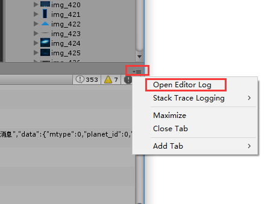

## log太长console 显示不全导致 message truncated
You can find it on these locations and it can be opened by any text editor:

* Mac osx:  ~/Library/Logs/Unity/Editor.log  
* Windows xp: C:\Documents and Settings\username\Local Settings\Application Data_\Unity\Editor\Editor.log  
* **Windows vista/7: C:\Users\username\AppData\Local\Unity\Editor\Editor.log**

You can read more about unity log files at unity documentation.
Editor.log 文件里会存unity启动后的所有log。  

#### 快捷打开方式：  

