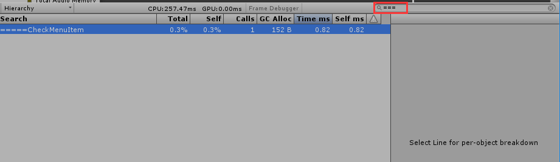
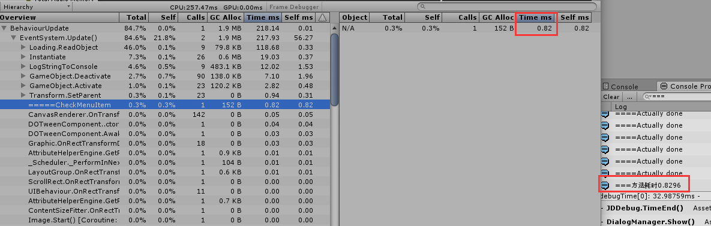
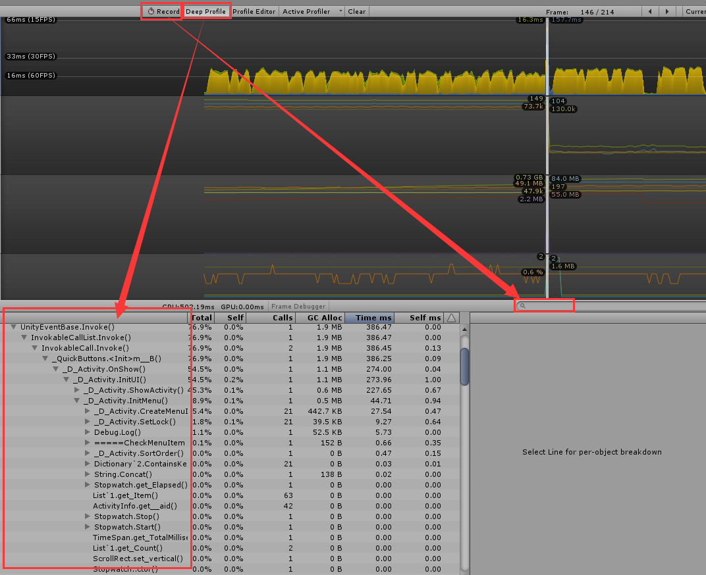

## Stopwatch或Profile调试函数耗时
除了用Stopwatch调试函数耗时外，还可以使用Profile的一个BeginSample方法。  
#### 1.Stopwatch  
    System.Diagnostics.Stopwatch time = new System.Diagnostics.Stopwatch();
    time.Start();
	//执行xxx方法
    time.Stop();
    Debug.Log("===方法耗时" + time.Elapsed.TotalMilliseconds);
    time.Reset();
    time.Start();
	//执行xxx方法
    time.Stop();
    Debug.Log("===方法耗时" + time.Elapsed.TotalMilliseconds);
#### 2.Profiler.BeginSample("=====xxx方法");
    Profiler.BeginSample("=====CheckMenuItem");
    //执行xxx方法
    Profiler.EndSample();  
结果如图：  
  
  
我只测试了一次，两个方法分别统计的时间相差极小。Stopwatch方便查看和插入，Profiler方法能看到GC和Calls，各有优缺点吧。  
**如果想要搜索Profiler.BeginSample("=====xxx方法")打印的文本需要先关掉Record按钮**，
### 3.Profiler窗口 
  
在开启了Deep Profile之后可以看到每个方法的耗时和GC，但是那会导致很卡。