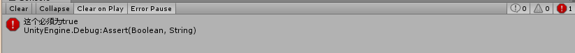
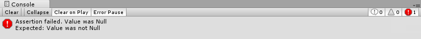

## Debug.Assert

	public static void Assert(bool condition);
	public static void Assert(bool condition, Object context);
	public static void Assert(bool condition, object message);
	public static void Assert(bool condition, object message, Object context);

**condition**：Condition you expect to be true.  
你期望为true，不为true则报错

例：   

	bool bo = false;
	Debug.Assert(bo, "这个必须为true");

## UnityEngine.Assertions.Assert ##
####  Assert.IsNotNull ####

    string sm=null;
    Assert.IsNotNull(sm);

此外Assert 还有很多断言的方法。[点击查看](https://docs.unity3d.com/ScriptReference/Assertions.Assert.html).
