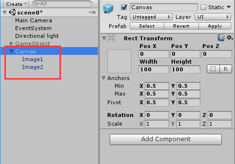
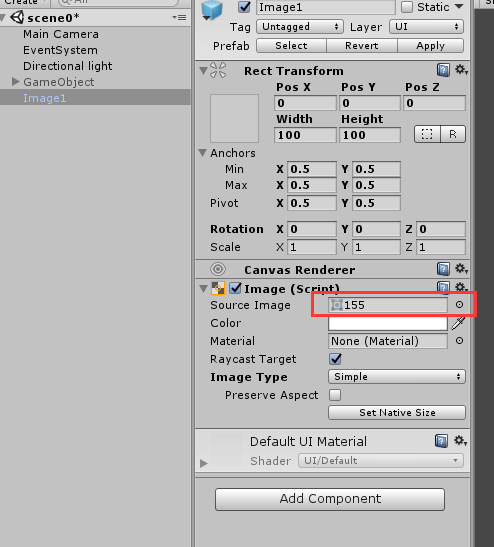
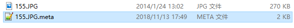
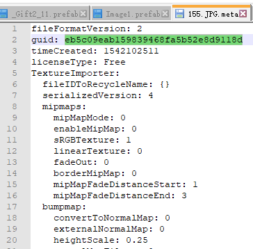

#### 资源引用与YMSL
Unity’s 的场景和pfb meta保存的格式是YMSL语言。  

####命名
YAML是"YAML Ain't a Markup Language"（YAML不是一种置标语言）的递归缩写。  
####功能  
简单表达清单、散列表，标量等资料形态。  
####栗子

	house:
	  family:
	    name: Doe
	    parents:
	      - John
	      - Jane
	    children:
	      - Paul
	      - Mark
	      - Simone
	  address:
	    number: 34
	    street: Main Street
	    city: Nowheretown
	    zipcode: 12345
####基本语法
* 字串不一定要用双引号标识；
* 在缩排中空白字符的数目并不是非常重要，只要相同阶层的元素左侧对齐就可以了（不过不能使用TAB字符）；
* 允许在文件中加入选择性的空行，以增加可读性；
* 在一个档案中，可同时包含多个文件，并用“---”分隔；
* 选择性的符号“...”可以用来表示档案结尾（在利用串流的通讯中，这非常有用，可以在不关闭串流的情况下，发送结束讯号）。  
####GameObject解析  
	
	%YAML 1.1
	%TAG !u! tag:unity3d.com,2011:
	--- !u!1001 &100100000
	Prefab:
	  m_ObjectHideFlags: 1
	  serializedVersion: 2
	  m_Modification:
	    m_TransformParent: {fileID: 0}
	    m_Modifications: []
	    m_RemovedComponents: []
	  m_ParentPrefab: {fileID: 0}
	  m_RootGameObject: {fileID: 1169681027852844}
	  m_IsPrefabParent: 1
	--- !u!1 &1030208336106410
	GameObject:
	  m_ObjectHideFlags: 0
	  m_PrefabParentObject: {fileID: 0}
	  m_PrefabInternal: {fileID: 100100000}
	  serializedVersion: 5
	  m_Component:
	  - component: {fileID: 224946823472463492}
	    m_Layer: 5
	    m_Name: Image2
	    m_TagString: Untagged
	    m_Icon: {fileID: 0}
	    m_NavMeshLayer: 0
	    m_StaticEditorFlags: 0
	    m_IsActive: 1
	--- !u!1 &1169681027852844
	GameObject:
	    m_ObjectHideFlags: 0
	    m_PrefabParentObject: {fileID: 0}
	    m_PrefabInternal: {fileID: 100100000}
	    serializedVersion: 5
	    m_Component:
	  - component: {fileID: 224004790975127698}
	    m_Layer: 5
	    m_Name: Canvas
	    m_TagString: Untagged
	    m_Icon: {fileID: 0}
	    m_NavMeshLayer: 0
	    m_StaticEditorFlags: 0
	    m_IsActive: 1
	--- !u!1 &1867243777602790
	GameObject:
	    m_ObjectHideFlags: 0
	    m_PrefabParentObject: {fileID: 0}
	    m_PrefabInternal: {fileID: 100100000}
	    serializedVersion: 5
	    m_Component:
	  - component: {fileID: 224236448325242998}
	    m_Layer: 5
	    m_Name: Image1
	    m_TagString: Untagged
	    m_Icon: {fileID: 0}
	    m_NavMeshLayer: 0
	    m_StaticEditorFlags: 0
	    m_IsActive: 1
	--- !u!224 &224004790975127698
	RectTransform:
	    m_ObjectHideFlags: 1
	    m_PrefabParentObject: {fileID: 0}
	    m_PrefabInternal: {fileID: 100100000}
	    m_GameObject: {fileID: 1169681027852844}
	    m_LocalRotation: {x: 0, y: 0, z: 0, w: 1}
	    m_LocalPosition: {x: 0, y: 0, z: 0}
	    m_LocalScale: {x: 1, y: 1, z: 1}
	    m_Children:
	  - {fileID: 224236448325242998}
	  - {fileID: 224946823472463492}
	    m_Father: {fileID: 0}
	    m_RootOrder: 0
	    m_LocalEulerAnglesHint: {x: 0, y: 0, z: 0}
	    m_AnchorMin: {x: 0.5, y: 0.5}
	    m_AnchorMax: {x: 0.5, y: 0.5}
	    m_AnchoredPosition: {x: 0, y: 0}
	    m_SizeDelta: {x: 100, y: 100}
	    m_Pivot: {x: 0.5, y: 0.5}
	--- !u!224 &224236448325242998
	RectTransform:
	    m_ObjectHideFlags: 1
	    m_PrefabParentObject: {fileID: 0}
	    m_PrefabInternal: {fileID: 100100000}
	    m_GameObject: {fileID: 1867243777602790}
	    m_LocalRotation: {x: 0, y: 0, z: 0, w: 1}
	    m_LocalPosition: {x: 0, y: 0, z: 0}
	    m_LocalScale: {x: 1, y: 1, z: 1}
	    m_Children: []
	    m_Father: {fileID: 224004790975127698}
	    m_RootOrder: 0
	    m_LocalEulerAnglesHint: {x: 0, y: 0, z: 0}
	    m_AnchorMin: {x: 0.5, y: 0.5}
	    m_AnchorMax: {x: 0.5, y: 0.5}
	    m_AnchoredPosition: {x: 0, y: 0}
	    m_SizeDelta: {x: 100, y: 100}
	    m_Pivot: {x: 0.5, y: 0.5}
	--- !u!224 &224946823472463492
	RectTransform:
	    m_ObjectHideFlags: 1
	    m_PrefabParentObject: {fileID: 0}
	    m_PrefabInternal: {fileID: 100100000}
	    m_GameObject: {fileID: 1030208336106410}
	    m_LocalRotation: {x: -0, y: -0, z: -0, w: 1}
	    m_LocalPosition: {x: 0, y: 0, z: 0}
	    m_LocalScale: {x: 1, y: 1, z: 1}
	    m_Children: []
	    m_Father: {fileID: 224004790975127698}
	    m_RootOrder: 1
	    m_LocalEulerAnglesHint: {x: 0, y: 0, z: 0}
	    m_AnchorMin: {x: 0.5, y: 0.5}
	    m_AnchorMax: {x: 0.5, y: 0.5}
	    m_AnchoredPosition: {x: 0, y: 0}
	    m_SizeDelta: {x: 100, y: 100}
	    m_Pivot: {x: 0.5, y: 0.5}

* !u!->类型 

1->GameObject  [参考YAML Class ID Reference](https://docs.unity3d.com/Manual/ClassIDReference.html)

  &6->可以是任意的但是在**本文件**要保证是唯一id，注意Transform中的一行m_GameObject: {fileID: 1030208336106410} 含义就是Transform绑定在id是1030208336106410的Gameobject上
  
  #### 层级的管理  
  
  
  那么在Hierarchy面板中显示的层级关系是怎么储存的呢。  
  
* 如上图的Canvas.prefab就是上面YMSL文件对应的pfb(为了演示方便去仅保留RectTransform组件)。

* 层级关系储存在Transform中而不是GameObject里。  

* GameObject为Canvas的有一个组件，fileID是224004790975127698，查找后发现这个ID是一个RectTransform(224),这个RectTransform有两个m_Children，也就是Image1和Image2的RectTransform了。

* 另外，Image1和Image2的RectTransform都含有字段m_Father指向同一个即Canvas的RectTransform  

* 可以知道不仅**父保存的子的fileID(m_Children)，子也保存了父的fileID(m_Father)**  
####资源(图片,音频)的引用
  
如图，这里有一个资源的引用。  
打开Image1.prefab看一下：(仅截取关键部分) 

	--- !u!114 &114656144764327436
	MonoBehaviour:
	  m_ObjectHideFlags: 1
	  m_PrefabParentObject: {fileID: 0}
	  m_PrefabInternal: {fileID: 100100000}
	  m_GameObject: {fileID: 1134970428811774}
	  m_Enabled: 1
	  m_EditorHideFlags: 0
	  m_Script: {fileID: -765806418, guid: f70555f144d8491a825f0804e09c671c, type: 3}
	  m_Name: 
	  m_EditorClassIdentifier: 
	  m_Material: {fileID: 0}
	  m_Color: {r: 1, g: 1, b: 1, a: 1}
	  m_RaycastTarget: 1
	  m_OnCullStateChanged:
	    m_PersistentCalls:
	      m_Calls: []
	    m_TypeName: UnityEngine.UI.MaskableGraphic+CullStateChangedEvent, UnityEngine.UI,
	      Version=1.0.0.0, Culture=neutral, PublicKeyToken=null
	  m_Sprite: {fileID: 21300000, guid: eb5c09eab159839468fa5b52e8d9118d, type: 3}
	  m_Type: 3
	  m_PreserveAspect: 0
	  m_FillCenter: 1
	  m_FillMethod: 4
	  m_FillAmount: 1
	  m_FillClockwise: 1
	  m_FillOrigin: 0
可以看到**m_Sprite**: {fileID: 21300000, guid: eb5c09eab159839468fa5b52e8d9118d, type: 3}  
我们打开对应文件的meta文件看一下  
  
  
好的。找到了