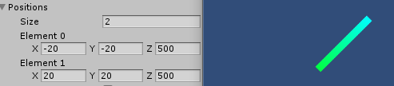
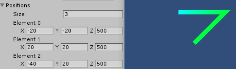
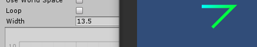
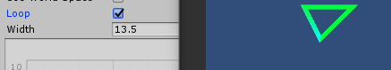
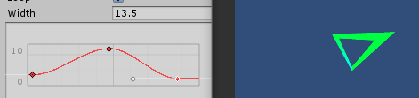
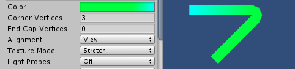
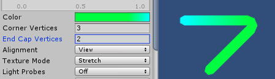
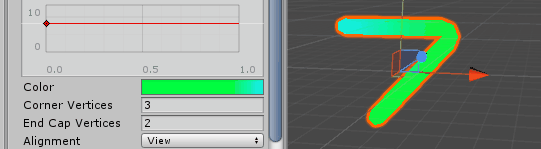
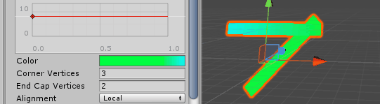

## LineRenderer组件
一个LineRenderer组件可以在3d空间下用直线连起多个点，

LineRenderer的线是连续的，如果是断断续续的(或者不能一笔画成的)，就只能新建多个GameObject然后挂上LineRenderer。

LineRenderer和  [Trail Renderer](https://docs.unity3d.com/Manual/class-TrailRenderer.html)有相同算法

### Properties

* **Cast Shadows**：是否投射阴影

* **Cast Shadows** ：是否接收阴影

* **Motion Vectors**：？

*  **Materials** ：材质

*  **Light Parameters** ：？

*  **Positions** ：Line会一次连接Positions里的坐标，如下：两个点和三个点的区别

  

*  **Use World Space** ：勾选时，上述Positions里Element的坐标都是世界坐标，大小也仅由Width控制。不勾选时，Positions是以当前transform.position为原点坐标系下的坐标。所以控制transform.Position/Rotation/Scale也能对LineRenderer生效。

*  **Loop** ：最后一个点是否连接到第一个点形成环状。不勾选与勾选情况如下：

  

*  **Width** ：line的宽度，可以使用curve面板来调整函数关系(面板刻度横坐标是从开始到结束总距离的归一化)

  

*  **Color** ：添加从开始到结束的渐变色，参考下面Corner Vertices的图

*  **Corner Vertices** ：添加顶点让拐角更平滑，这个值代表多添加几个顶点。下图为每个拐角多添加3个顶点的情况

  

*  **End Cap Vertices** ：添加顶点让开始和结束更平滑。下图为开始和结束多添加2个顶点的情况

  

*  **Alignment** ：设置为View，则顶点间的连线总是正面朝着摄像机(所有摄像机包括玩家视角)。设置为Local，则变成了沿着Transform的平面，而且Corner Vertices与End Cap Vertices不再生效

  

  

*  **Texture Mode** ：参考Shader/13.Tilling and offset.md

*  **Light Probes** ：？
*  **Reflection Probes** ：？