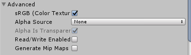

## Texture Importer

[官网介绍](https://docs.unity3d.com/Manual/class-TextureImporter.html)

* Read/Write Enabled：勾上这个选项，可以通过脚本使用 [Texture2D.SetPixels,Texture2D.GetPixels](../API/35.Texture2D.md)等Texture2D的方法读写这个Texture(未勾选此选项使用这些方法会报错)，而且cpu会创建一个副本用于脚本的修改，这会使该Texture占用的**内存空间翻倍**，所以这个选项的缺省值是false，只有当你确定需要读写时才勾选此选项。另外通过脚本自行动态创建的Texture的isReadable属性总是返回True。

  
  
* Wrap Mode：纹理坐标的换行模式。[参考1](../Shader/13.Tilling and offset.md)[参考2](../API/33.Texture.md)

  设置该模式实际上影响的是shader中使用的unity内置的取纹理颜色的函数tex2D(纹理,坐标)。

  ​    Repeat：重复
  ​    Clamp：伸展边缘
  ​    Mirror：镜像
  ​    Mirror Once：镜像一次
  ​    Per-axis：对每个坐标轴分别处理
