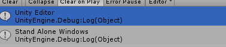
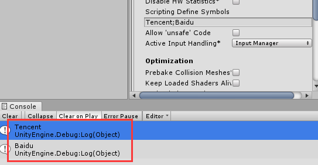
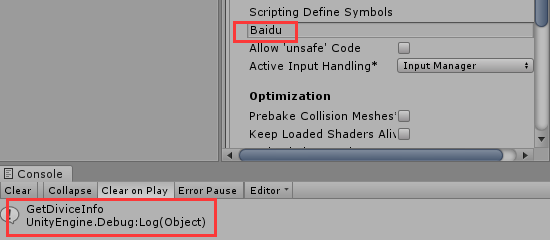

### 13.Unity编辑器宏命令

#### unity中有关平台的预编译指令

[官网链接](https://docs.unity3d.com/Manual/PlatformDependentCompilation.html)

通过判断不同的宏定义我们可以在不同的平台编译不同版本的代码。

例如如下代码

```
    void Start()
    {
        #if UNITY_EDITOR
                Debug.Log("Unity Editor");
        #endif
            
        #if UNITY_IOS
              Debug.Log("Iphone");
        #endif

        #if UNITY_STANDALONE_WIN
                Debug.Log("Stand Alone Windows");
        #endif
    }

```

我们在安装了unity的windows的电脑上运行就会打印出



#### 自己定义宏命令

游戏在打包的时候可能需要在不同的渠道进行不同的操作。这时我们可以定义自己的宏命令。

如

```
    void Start()
    {
        #if Tencent
                Debug.Log("Tencent");
        #endif
            
        #if Ali
              Debug.Log("Ali");
        #endif

        #if Baidu
                Debug.Log("Baidu");
        #endif
    }
```

这时我们在File->Build Setting->Player Settings->Scripting Define Symbols

添加自己的宏定义，用分号隔开，如图，



**使用不同的宏定义其实是编译了不同的可执行程序**

#### 使用c#的Conditional

参考[这篇文章](https://blog.csdn.net/fdyshlk/article/details/77603287/)

 Conditional其实是一个属性类：ConditionalAttribute的简称。可应用于方法或者属性类。

例如：如果是baidu的渠道我们就获取设备信息，则可以这样写

    void Start()
    {
        GetDeviceInfo();
    }
    
    [Conditional("Baidu")]
    void GetDeviceInfo()
    {
        Debug.Log("GetDiviceInfo");
    }
在宏定义上添加Baidu则可以执行GetDeviceInfo()方法，反之则执行空方法。



