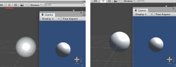

### Scene view

---

#### Scene view Control Bar

[参见官网](https://docs.unity3d.com/2018.4/Documentation/Manual/ViewModes.html)

也就是这一栏

可以让你选择场景中各种选项。控制光照和声音是否开启。只影响开发时的场景而不影响打包结果。

##### Shader mode

* **Shaded**: 显示纹理
* **Wireframe**: 显示网格线框
* **Shaded Wireframe**: 同时显示纹理和网格线

##### Miscellaneous

* 。。。

##### 2D, lighting and Audio switches

* **2D**:场景切换成2d或者3d。

* **Lighting**：开启时使用场景里的光照，关闭时会默认使用附加在相机上的光照。

  ​	开启后可以保持与game view中的光照统一，对比如下，建议开启

  ​	

* **Audio**: 是否开启场景中的声音

等等等

