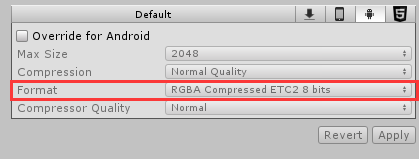

#### Library
参考：[unity官网](https://docs.unity3d.com/Manual/BehindtheScenes.html)  
unity 主目录下有个library文件。里面存放有你在Assets里的一些game-ready文件，  

game-ready文件：作为一个png文件，游戏是不能直接使用的，需要转换成对应2进制或对应制式，就像我们在切换平台是要等待资源处理一会一样。如在ios 处理对应格式为  
  
android处理对应格式为  
   

这些游戏就绪文件就会被放在放到library文件夹里，所以library里的所有文件都是根据Assets和ProjectSettings里的文件创建的，因此在做版本控制的时候不需要添加library文件。   
