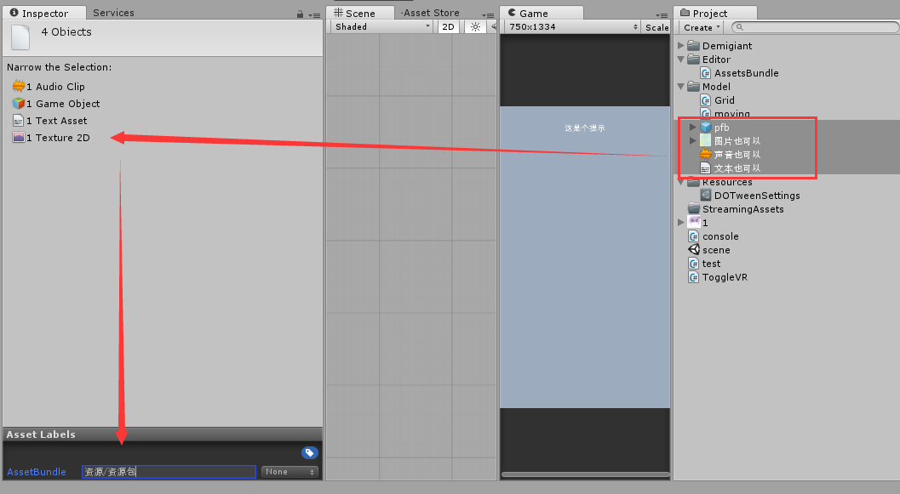
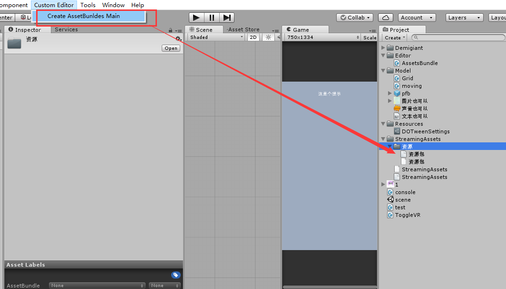
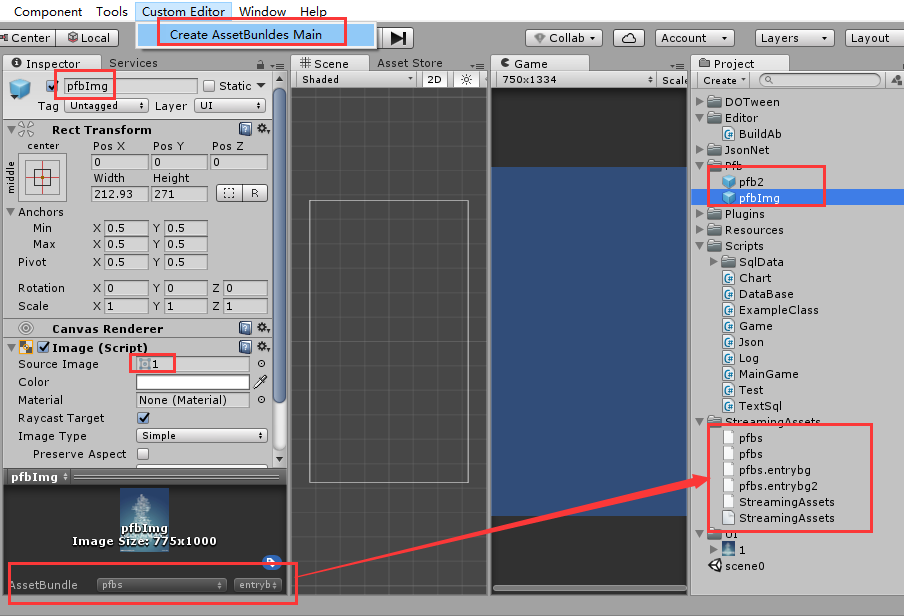
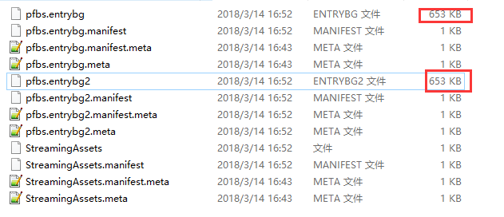
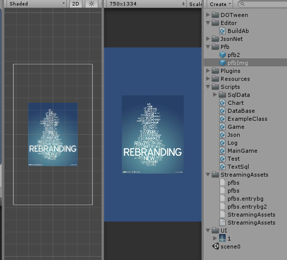
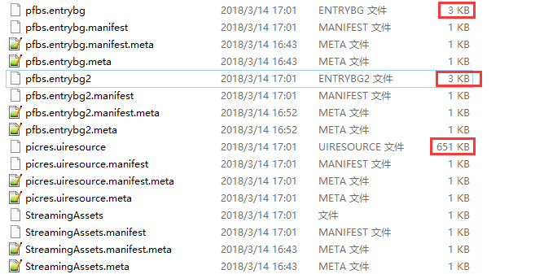
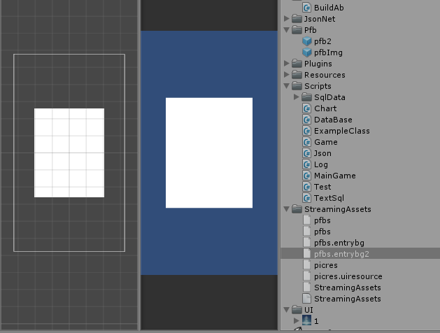

#### AssetBundle 的使用
[官网](https://docs.unity3d.com/Manual/AssetBundles-Workflow.html#AssetBundles-Preparing)
##### 1.新建AB资源包
根据以下步骤把资源打进一个AB包。  

* 1.从Project View选中想要打包的资源
* 2.在inspector窗口检查下这些资源在否
* 3.在inspector窗口底部，你会看到分配资源包和别名的部分
* 4.左边的下拉框设置资源包，右边的下拉框设置别名。
* 5.点开左边"None"的选项，设置当前资源包的名字
* 6.如果还未被创建，你可以看到一个像上面图片一样的列表
* 7.点击"New..."新建一个资源包
* 8.输入想要的资源包名字，提示：资源包的名字支持 文件夹结构的形式，可以添加一个子文件夹，用"/"分割。例如：一个资源包的名字如果是"enviroment/forest"将会在environment的文件夹下创建名为forest的资源包。
* 9.设置好了资源包的名字后，如果你乐意的话可以在右边下拉框设置别名。当然别名不是必须的。

一切都设置好后，还要配上Editor脚本才能实现资源打包。 

	using UnityEditor;
	using UnityEngine;
	public class AssetsBundle : MonoBehaviour {
	
	    [MenuItem("Custom Editor/Create AssetBunldes Main")]
	    static void CreateAssetBunldesMain()
	    {
	        BuildPipeline.BuildAssetBundles("Assets/StreamingAssets", BuildAssetBundleOptions.None, BuildTarget.Android);
	
	    }
	}
这样，在菜单栏点击Custom Editor/Create AssetBunldes Main按钮之后就会在Assets/StreamingAssets路径下生成资源包了。
  
  
`BuildPipeline.BuildAssetBundles`还有一个重载类型，即不手动选择资源，而是直接将资源信息作为参数传进去打包。代码参考如下:  

    AssetBundleBuild[] buildMap = new AssetBundleBuild[1];
    string[] enemyAssets = new string[6];
    enemyAssets[0] = "Assets/Model/声音也行.wav";
    enemyAssets[1] = "Assets/Model/图片也可以.jpg";
    enemyAssets[2] = "Assets/Model/文本也可以.txt";
    enemyAssets[3] = "Assets/Model/pfb.prefab";
    buildMap[0].assetNames = enemyAssets;
    buildMap[0].assetBundleName = "enemybundle";
    BuildPipeline.BuildAssetBundles("Assets/StreamingAssets", buildMap,BuildAssetBundleOptions.None, BuildTarget.Android);

##### 2.载入资源包
对资源包的载入分为本地加载网络加载。  
本地加载用的不多，网络加载多是处理热更新资源之类的。  
###### 1.本地加载  
    AssetBundle myLoadedAssetBundle = AssetBundle.LoadFromFile(Path.Combine(Application.streamingAssetsPath,"资源包"));
    if (myLoadedAssetBundle == null) {
        Debug.Log("Failed to load AssetBundle!");
        return;
    }
    GameObject prefab = myLoadedAssetBundle.LoadAsset<GameObject>("pfb");
    Instantiate(prefab,transform,false);
    bgPic.sprite = myLoadedAssetBundle.LoadAsset<Sprite>("图片也可以");
    text.text = myLoadedAssetBundle.LoadAsset<TextAsset>("文本也可以").ToString();
###### 2.网络加载
网络加载首先要将资源放到服务器上，载入时的路径填写网络地址就可以了  

    StartCoroutine(InstantiateObject());
    

    IEnumerator InstantiateObject()
    {
        string uri = "https://yuanxinchao.github.io/technology/unity/AssetsBundleTest/资源包";
        UnityWebRequest request = UnityWebRequest.GetAssetBundle(uri, 0);
        yield return request.Send();
        AssetBundle bundle = DownloadHandlerAssetBundle.GetContent(request);

        GameObject prefab = bundle.LoadAsset<GameObject>("pfb");
        Instantiate(prefab, transform, false);
        bgPic.sprite = bundle.LoadAsset<Sprite>("图片也可以");
        text.text = bundle.LoadAsset<TextAsset>("文本也可以").ToString();
    }  
##### 3.载入资源包  
如图：  
  
使用上述方法打包时，unity会将所有打上标签的资源打包(图左下,脚本不会打进去),这里我们将引用了1.png的pfbImg和pfb2打包成ab包。这时候我们去文件夹下看看大小。   
  
两个资源都是653kb，这是因为两个资源包分别将1.png的资源分别打进了自己的包里，这个时候如果使用代码加载的话。运行之后显示正常。

	AssetBundle myLoadedAssetBundle = AssetBundle.LoadFromFile(Path.Combine(Application.streamingAssetsPath, "pfbs.entrybg"));
	if (myLoadedAssetBundle == null)
	{
		Debug.Log("Failed to load AssetBundle!");
		return;
	}
	GameObject prefab = myLoadedAssetBundle.LoadAsset<GameObject>("pfbImg");
	Instantiate(prefab, transform, false);  
   
>但是为了避免资源重复，正确的做法是将1.png这张图作为图片资源打包，如下图中的**picres.uiresource**就是放的图片资源，这样整体的大小缩减了近一半。但是我们在打包的时候并没有决定先后顺序，估计是unity会按照特定顺序先将图片文本等打包，再将预设打包，这样如果AB有对应资源就不必再重复打进去。  

  
**但是：**这个时候再使用上面的代码进行加载运行时，画面中出现的是白屏，即pfb未找到引用的1.png的资源。  
  
>这是因为图片的资源还未加载，上面一个例子能够正常运行是因为图片资源和pfb打进了同一个标签一同载入了。所以正确的做法是先将图片资源加载进来再加载pfb。  
 
    //加载图片资源
    AssetBundle pic = AssetBundle.LoadFromFile(Path.Combine(Application.streamingAssetsPath, "picres.uiresource"));
    pic.LoadAllAssets<Sprite>();
    AssetBundle myLoadedAssetBundle = AssetBundle.LoadFromFile(Path.Combine(Application.streamingAssetsPath, "pfbs.entrybg"));
    if (myLoadedAssetBundle == null)
    {
        Debug.Log("Failed to load AssetBundle!");
        return;
    }
    GameObject prefab = myLoadedAssetBundle.LoadAsset<GameObject>("pfbImg");
    Instantiate(prefab, transform, false); 
啰嗦了这么多就两点：  
> * 1.为避免ab包过大需将ab资源合理拆分。  
> * 2.加载时注意顺序，务必先将场景或pfb依赖的资源先加载。
