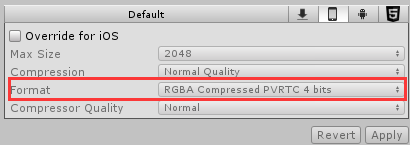
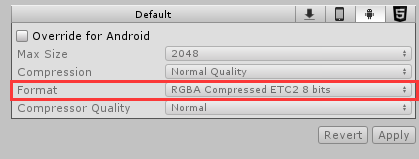

### unity 中的一些文件夹 ###
### 1.Assets
包含游戏所有的资源，脚本，图片，声音，自己遍写的Editor文件等  
### 2.ProjectSettings
储存 Edit->ProjectSetting 下的可自定义内容  
对应的.asset对应对应的设置
### 3.Library
game-ready文件：作为一个png文件，游戏是不能直接使用的，需要转换成对应2进制或对应制式，就像我们在切换平台是要等待资源处理一会一样。如在ios 处理对应格式为  
  
android处理对应格式为  
   

这些游戏就绪文件就会被放在放到library文件夹里，所以library里的所有文件都是根据Assets和ProjectSettings里的文件创建的，因此在做版本控制的时候不需要添加library文件。   
### obj and Temp
build时产生的临时文件，第一个是用于MonoDevelop，第二个是Unity
