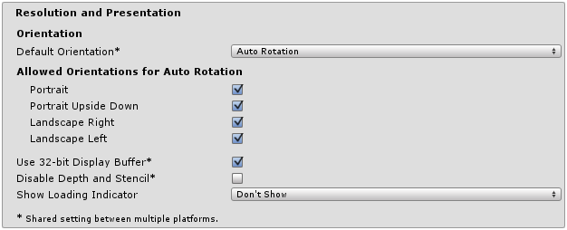

#### Android Player Settings
#### Resolution And Presentation  
  

Property|Function
---|---
Default Orientation|设置屏幕默认方向
Portrait|home键在最底部
Portrait Upside Down|home键在最顶部
Landscape Left|home键在右手边
Landscape right|home键在左手边
**Allowed Orientations for Auto Rotation**|当默认朝向是Auto Rotation时可见，且在下拉列表中选择屏幕允许自动旋转的朝向
Use 32-bit Display Buffer|使用32位显示缓冲器，一般不选
Disable Depth and Stencil|与图层深度相关，勾选有可能会导致UGUI的ImageMask组件显示不正常[Note](https://open.gl/depthstencils)
Show Loading Indicator|展示加载标识，勾选后可以使用Handheld开启loading图示，详见unity/API/22.Handheld.md  
**Icon**|
Override for Android|复写不同大小的icon
Enable Android Banner|Android TV广告banner 
**Splash Image**|
Virtual Reality Splash Screen|vr设备闪屏
Android Splash Screen|Android设备闪屏
Splash Scaling|闪屏尺寸适配屏幕尺寸方式(有三个选项)
**Other Settings**|
Color Space	|人眼对光强不是线性变化的，一般选Gamma，这个会对人类视觉特性进行补偿,(经测试对UGUI貌似无效果)  
Auto Graphics API|一般勾选，勾选后会按照 GLES3.1->3->2 的顺序选择渲染的api，目前新出的Android手机应该都支持GLES3  
Multithreaded Rendering|多线程渲染，开启后可以优化瓶颈在cpu的程序。(有可能会导致崩溃)勾选
Static Batching|静态批处理
Dynamic Batching|动态批处理
GPU Skinning|enable OpenGL ES 3 GPU skinning 仅适用于vr，且为试验功能
Graphics Jobs|与动态批处理冲突，试验性功能
Virtual Reality Supported|开发vr应用时勾选，为应用添加必要的vr sdk
Protect Graphics Memory|保护图形内存(在支持的硬件上这将确保用户无法截图),默认不勾选
**Scripting Backend**|IL2CPP和Mono2x两个选项
IL2CPP|iOS和WebGL平台只能选择此选项(最终后转换c++代码由对应平台的c++解释器执行)