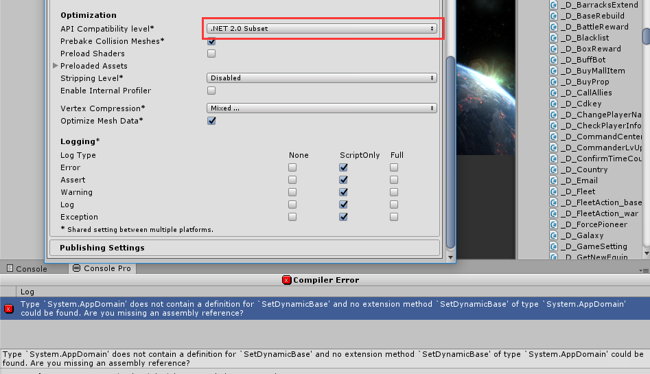

#### .Net2.0 and .Net2.0SubSet
PlayerSetting里面有个设置API Compatibility Level的选项，可以选.Net2.0 或者 .Net2.0 Subset.那么两者之间有什么区别呢。  
1. .Net2.0 Subset是.Net2.0的子集，比.Net2.0少了几个API。  
2. 想要知道具体少了哪些参考[Mono Compatibility](https://docs.unity3d.com/412/Documentation/ScriptReference/MonoCompatibility.html)。  
3. 默认.Net2.0 Subset，这样可以减少包体大小，而且并没有减少几个api，不会影响正常使用。  
**栗子：**(仅测试)  AppDomain.SetDynamicBase()这个就是子集缺少的几个api之一。

    AppDomain a = null;
    a.SetDynamicBase("a");
上面代码在API Compatibility Level选项为**.Net2.0**时，**不会报编译错误**，但是如果把选项改为.Net2.0 Subset时就出报错，如下图。  
