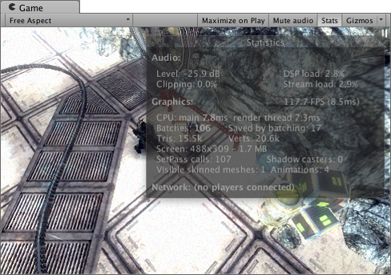

####Rendering Statistics Window
  
如图，在Game视图的右上角有一个Stats按钮，按下后会展示实时的渲染数据，这个在优化性能的时候非常重要。  
这个窗口包含的信息有:
>1.FPS  
>每秒刷新帧率以及刷新一帧需要的时间。如图则为每秒刷新117.7次，8.5ms刷新一帧(两者互为倒数)。  
>2.Batches  
>批处理：批处理是引擎为了减少当资源切换时造成的CPU消耗而尝试将多个物体的渲染组合到一块内存中。  
>3.Saved by batching  
>通过批处理减少的渲染次数。共用材质，保持渲染状态相同可以达到好的批处理效果。  
>4.Tris and Verts  
>画出的三角形数量和顶点数量,这对于低端硬件的优化来说是最重要的。  
>5.Screen  
>屏幕的大小，抗锯齿等级和内存使用。  
>6.SetPass calls(Draw Call)  
>渲染通道的数量，每个通道需要unity在运行时绑定的一个新的着色器，它可能导致CPU的负荷。  
>Visible Skinned Meshes  
>渲染的皮肤网格的数量。  
>Animations  
>正在播放的动画的数量。